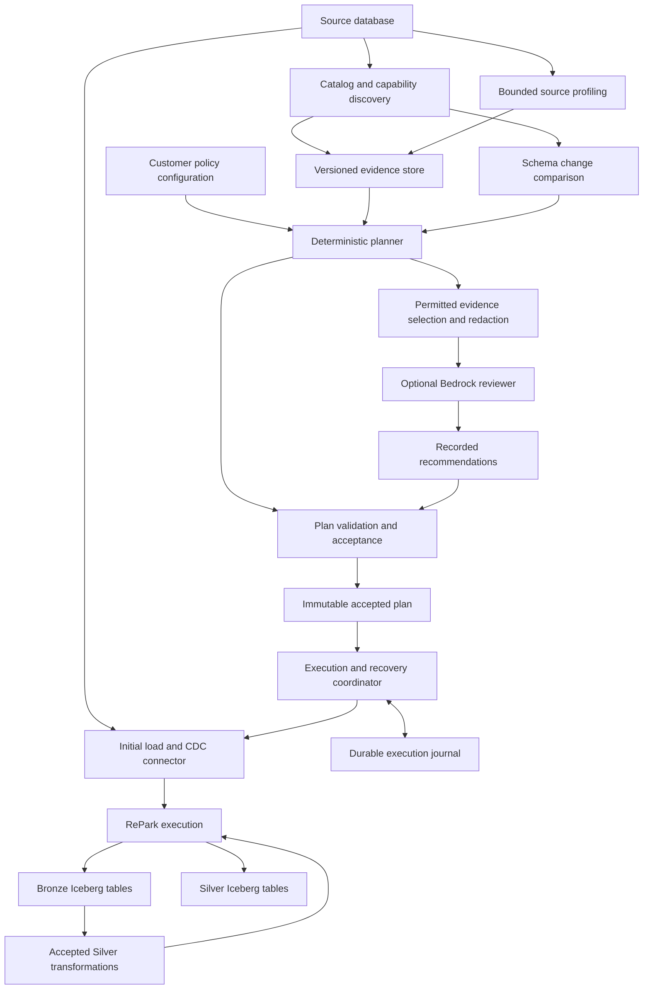

# RePark: Database Discovery and Lakehouse Planning Architecture

Date: 2026-09-09  
Status: Architecture proposal; implementation and operational guarantees remain to be verified.  
Lifecycle: This standalone proposal closes when an accepted repository design supersedes it. Preserve it as the proposal record.

## 1. Purpose

Provide an evidence-based path from an operational database to an Iceberg lakehouse. A user supplies a source connection, a destination, and transformation policies. The platform discovers the source, profiles selected data, proposes a migration plan, and identifies decisions that require review. An accepted plan can later drive initial loading, change data capture (CDC), and schema evolution through RePark.

The product promise is explainable automation: each decision records its evidence, each applied change follows an accepted policy, and each execution has a recoverable outcome.

The architecture is independent of customer names, industry conventions, and naming prefixes. Source schemas, table names, missing-value policies, retention settings, and business rules are configuration. PostgreSQL is the proposed first source. SQL Server follows through the same contracts, with source-specific capture semantics.

This is a lakehouse ingestion and planning product. It does not reproduce an operational database's triggers, indexes, stored procedures, sequence state, or application transaction behavior in Iceberg.

## 2. Relationship to RePark

The platform sits above RePark's query and table APIs. RePark remains the execution engine; its owned Iceberg fork remains the table-format engine. Discovery and planning do not require distributed query execution.

The current repository separates engine code, SQL entry points, Python bindings, and Iceberg integration. The proposal preserves those boundaries. Python may manage metadata and construct plans. Source-row decoding and local data transformations belong in Rust; source databases may execute pushed-down profiling queries.

As reviewed on 2026-09-09, the roadmap places database connectors, incremental processing, and connector CDC in future milestones. This proposal describes a consumer of those capabilities, not a claim that they already exist. Repository contracts and delivery state remain authoritative in [AGENTS.md](/home/john/CodeRepos/LocalRepark/repark/AGENTS.md), [ARCHITECTURE.md](/home/john/CodeRepos/LocalRepark/repark/ARCHITECTURE.md), [STATUS.md](/home/john/CodeRepos/LocalRepark/repark/STATUS.md), and the [release roadmap](/home/john/CodeRepos/LocalRepark/repark/task/roadmap/epic-term/release-roadmap-2026-08-29.md).

## 3. System overview

The diagram describes responsibilities, not a mandatory service deployment. The first implementation can use a single coordinator process with durable storage. Do not create separate services or speculative crates before their implementation requires them.

## 4. Component contracts

| Component | Owns | Outputs and boundaries |
|---|---|---|
| Connection registry | Source identity, secret references, destinations, connection validation | Session-scoped connections; no credentials in plans or reports |
| Source adapter | Catalog queries, type metadata, capability detection, source-specific SQL | Structured schema and capability records; explicit unsupported cases |
| Profiler | Query selection, budgets, measurements, sampling provenance | Typed profiles and a completeness manifest |
| Evidence store | Immutable discovery and profiling runs | Versioned evidence with timestamps, identity, and content hashes |
| Planner | Deterministic rules, target mappings, dependencies, unresolved decisions | A declarative proposed plan; no external writes |
| Model reviewer | Optional interpretation of permitted evidence | Suggestions attached to decisions; no execution authority |
| Plan validator | Type compatibility, identities, references, policy checks | Accepted or blocked decisions and a reviewable change set |
| Execution coordinator | Scheduling, attempts, checkpoints, fencing, recovery | Durable job and batch outcomes |
| RePark engine | Query planning, row transformations, sanctioned Iceberg writes | Data results and table write outcomes through existing APIs |
| Owned Iceberg fork | Table-format primitives and commit semantics | Capabilities remain documented in the fork's own contracts |

Infrastructure provisioning is a separate operation. Discovery can produce a prerequisite report and an infrastructure change proposal. It does not create roles or alter source capture settings as a side effect of inspection.

## 5. Discovery and source identity

Extract structured metadata directly from source catalogs. Render reconstructed DDL as a human-readable attachment, not as the planner's primary input.

For each supported source object, capture:

- Source instance and database identity, schema, table, and source object identifiers where available.
- Column identity, order, declared type, precision, scale, nullability, collation, and time-zone semantics.
- Primary and unique keys, including ordered composite columns and constraint validity where available.
- Foreign keys, generated columns, defaults, and relevant partition relationships.
- Capture readiness, replica identity or equivalent, required permissions, and unsupported types.
- Visibility limitations: objects unavailable through permissions must not be treated as absent.

Persist a canonical schema fingerprint and a discovery timestamp. Source object identifiers are scoped to a database and its lifecycle; a restored or recreated object must not silently inherit an old mapping.

Catalog discovery does not automatically provide a transactionally consistent view across multiple queries. The adapter records the consistency method. If it cannot obtain a consistent observation, recheck the schema before accepting a plan and before extraction.

## 6. Bounded profiling

Profiling proceeds from cheaper evidence to more expensive evidence. Each stage runs only when it can resolve a planning question within the configured budget.

| Tier | Work | Boundaries |
|---|---|---|
| 0 | Catalog estimates and available optimizer statistics | Record freshness, privileges, and missing statistics |
| 1 | Selected null, range, length, and cardinality measurements | Bound query duration and table scope; select metrics by need |
| 2 | Frequency summaries for selected columns | Limit eligible columns and returned values; apply disclosure policy |
| 3 | Histograms or targeted validation queries | Run only for unresolved decisions that justify the cost |

A single aggregate statement can still perform expensive sorting, hashing, and temporary disk work. Query count is not a source-load guarantee. Missing row estimates must not silently select a full-table scan.

Configuration includes table allowlists, concurrency, statement and lock timeouts, a run deadline, sample limits, maximum returned evidence size, and per-tier permissions. Enforce hard limits where the source provides mechanisms; label estimated limits honestly elsewhere. Prefer replicas when their freshness and capture behavior meet the intended use.

Each measurement records its source schema version, query or query-template version, observation interval, sample method, sample population, and exact/estimated/sampled classification. Independently sampled tiers must not be presented as one shared population.

The run manifest lists requested, completed, partial, failed, excluded, and unsupported tables. Missing measurements remain unknown. No failed table disappears from the inventory. Persist completed table results incrementally so a large run can resume without repeating all work.

## 7. Evidence and decision model

Use versioned, validated records at boundaries. Rust owns execution contracts. Python metadata interfaces use Pydantic models in accordance with repository conventions. Human-readable YAML or JSON is a rendering of the validated plan.

| Record | Required content |
|---|---|
| Discovery run | Source identity, visibility, schema fingerprint, observation interval, adapter version |
| Profile run | Discovery reference, measurement provenance, budget usage, completeness manifest |
| Decision | Stable ID, proposed value, rule version, evidence references, rationale, alternatives, validation state |
| Recommendation | Decision ID, model and prompt versions, permitted input hash, suggested value, usage, response status |
| Plan | Source and destination identities, schema mappings, policies, dependencies, blockers, content hash |
| Acceptance | Accepted plan hash, approving identity or policy version, scope, timestamp |
| Execution batch | Accepted plan hash, source boundaries, sink identity, attempt, fencing token, commit and recovery state |

Separate evidence classes: declared constraint, measured observation, heuristic inference, and user policy. A heuristic confidence score is not a calibrated probability or an authorization to execute.

Identical evidence, rule versions, and policies must produce identical canonical planning output. Timestamps and run IDs belong in provenance outside the semantic plan hash. Model responses are stored inputs to a revised plan; model inference itself is not treated as deterministic.

## 8. Planning rules

### Keys and ordering

Use declared valid keys and supported replication identity before proposing inferred keys. Preserve composite keys. Snapshot uniqueness establishes an observation about that snapshot; it does not establish future uniqueness or a business identity.

A nearly unique column does not prove version history. A hash of selected attributes does not establish source identity. Tables without a supported identity remain blocked for update/delete replication unless a separately specified strategy preserves duplicates and changes correctly.

Keep three concepts separate: source identity, source change ordering, and business event time. An updated timestamp or ingestion timestamp cannot replace the source's capture position and event ordering. History accumulation is an explicit policy, including tie handling and late changes.

### Types and missing values

Preserve source precision, meaningful time-zone behavior, NULLs, and binary payloads by default. An unsupported mapping blocks the affected table or column according to explicit policy; it does not silently stringify or discard data.

Do not infer required decimal scale from minimum and maximum alone. Validate any permitted narrowing against the relevant data and define future out-of-range behavior. Do not infer an enforced boolean domain from sampled or truncated frequency results.

Missing-value substitution is opt-in. Distinguish NULL, blank text, zero, and configured sentinels. No observed sentinel collision is not proof that future collisions cannot occur. Unknown collision counts remain unknown.

### Names and dependencies

Naming policies are configurable. Validate normalization collisions, reserved names, valid target identifiers, and namespace collisions before plan acceptance. Preserve explicit source-to-target mappings instead of depending on reconstructed names.

Changes to keys, types, or target names trigger validation of dependent decisions. A model recommendation cannot replace a key while leaving an old classification or transformation plan accepted.

## 9. Optional Bedrock review

The deterministic planner works without a model. Bedrock may explain uncertain relationships, suggest mappings, and turn unresolved decisions into concise review questions. It cannot establish uniqueness, authorize a destructive change, or invent missing source evidence.

Only policy-permitted evidence reaches the reviewer. Catalog statistics, frequent values, minimum values, and maximum values can contain sensitive source data. A column-name classifier is advisory and cannot authorize disclosure. Use explicit allowlists, redaction, and evidence-size limits before serialization.

Treat database comments, names, and sampled text as untrusted content. The reviewer receives no source credentials or executable tools. Its output must pass structural validation and the same semantic checks as a manually proposed decision.

Use Bedrock structured outputs where the selected model supports them. Structural compliance does not prove business correctness; see [Bedrock structured-output documentation](https://docs.aws.amazon.com/bedrock/latest/userguide/structured-output.html).

Bound model use with per-request input/output limits, a maximum request count, capped retries, and a per-run spend budget. Record actual usage when available. Cache recommendations by permitted evidence hash, policy version, rule version, prompt version, and model version. On exhaustion or failure, preserve the deterministic plan and its unresolved decisions.

## 10. Plan acceptance and execution

Planning states are `DRAFT`, `VALIDATING`, `NEEDS_REVIEW`, `ACCEPTED`, and `SUPERSEDED`. Execution states are separate. A valid plan can still be unexecutable because capture prerequisites or destination permissions are missing.

An accepted plan is immutable. Acceptance applies to its exact hash and policy scope. Evidence changes create a new revision; they do not silently modify an accepted plan. Revalidate source identity, schema, destination identity, and permissions before effects begin.

Preapproved policies can accept narrowly defined compatible changes. Other decisions remain explicit review items. The interface shows the proposed result, supporting evidence, data-loss implications, and operational prerequisites.

Generated Python is not the execution contract. Compile a validated declarative plan into RePark operations through its existing session and SQL interfaces. Shared machinery serves both SQL doors where new SQL capabilities are introduced.

## 11. Bronze, Silver, and CDC recovery

### Bronze

The proposed first CDC Bronze representation is a replayable change log, preceded by a consistent initial snapshot. Define snapshot records and change records explicitly. Preserve source identity, operation kind, capture position, transaction and event ordering, ingestion time, schema version, and available before/after values.

Availability of before images and complete values is source-specific. The adapter must describe absent values distinctly from SQL NULL. Do not claim an event contains a full row when the capture protocol provides only changed fields.

### Silver

The proposed first Silver target is a current-state table keyed by a validated source identity. It applies accepted naming, type, and quality policies. History tables, inferred joins, and continuously maintained aggregates require separate contracts.

Record progress independently for each target. A Bronze commit and a Silver commit do not form one atomic multi-table transaction. Silver can lag and recover from retained Bronze input. Report that lag and the consistency scope explicitly.

### Capture and recovery protocol

1. Validate source capture prerequisites and destination capabilities.
2. Establish a source-specific snapshot-to-stream boundary with no gap.
3. Persist batch intent before sink effects. Identity includes the source generation, stream, partition where applicable, source boundaries, target, and accepted plan.
4. Assign an attempt and fencing token. Permit only the authorized attempt to advance durable progress.
5. Execute through RePark and retain enough durable evidence to reconcile the sink outcome.
6. Record the committed outcome before advancing the corresponding checkpoint or source acknowledgement.
7. On restart, reconcile an uncertain outcome before replaying it. Never assume an unknown commit failed.

A coordinator crash after a sink commit but before checkpointing must not apply the logical batch twice. The implementation needs a proven deduplication and reconciliation mechanism; an operation UUID or snapshot marker alone is insufficient. Source acknowledgement follows durable recoverability, not receipt of an event in memory.

Define retention across source logs, Bronze data, journal records, and Iceberg snapshots. Expired recovery evidence blocks automatic replay and produces an explicit resynchronization procedure. Cleanup must not delete files that may belong to a successful but unconfirmed commit.

End-to-end replay guarantees remain an implementation proof obligation. Do not advertise exactly-once behavior until the specified crash and concurrency cases pass.

## 12. Schema evolution

Detect drift through structured schema comparison. Keep versioned mappings from source columns to Iceberg field IDs. Do not identify a column solely by its name or ordinal. Recreated source objects require identity checks.

| Change class | Default response |
|---|---|
| Compatible nullable addition | Eligible for policy acceptance after source-capture and target validation |
| Supported lossless widening | Eligible only under a tested compatibility rule |
| New non-null column | Require a valid historical-value or backfill strategy |
| Rename | Require identity evidence or explicit mapping |
| Drop or narrowing | Block automatic propagation; produce a migration proposal |
| Key, collation, time-zone, or capture-identity change | Pause affected application and require a new plan |
| Unsupported source type | Preserve the blocker and report the affected objects |

Install the target schema before applying records that require it. Bind records to the schema used to decode them. A periodic catalog crawl alone cannot recover an intermediate schema that disappeared between crawls; each adapter must define detection, capture metadata, buffering, and refusal behavior.

PostgreSQL logical replication does not replicate DDL commands. This architecture therefore requires explicit schema coordination rather than assuming CDC carries schema migrations. See [PostgreSQL replication restrictions](https://www.postgresql.org/docs/18/logical-replication-restrictions.html).

## 13. Access and deployment

Separate discovery, capture setup, runtime capture, destination writes, and model invocation permissions. A read-only source connection can support discovery within its visibility. It does not imply authority to configure replication.

PostgreSQL replication connections require replication privileges and source setup. SQL Server CDC enablement requires elevated permissions. Report these prerequisites without requesting permanent administrative credentials for the runtime. See [PostgreSQL replication security](https://www.postgresql.org/docs/18/logical-replication-security.html) and [SQL Server CDC setup](https://learn.microsoft.com/en-us/sql/relational-databases/track-changes/enable-and-disable-change-data-capture-sql-server?view=sql-server-ver17).

For AWS deployment, use customer-provisioned scoped roles and secret references. Separate model access from destination write access. Provisioning authority must not be inherited by the crawler. A hosted cross-account deployment requires tenant-bound role assumption and destination validation before it is offered.

Begin with one trusted customer environment per deployment. Shared multi-tenant hosting requires a separate authentication, isolation, quota, and audit design. Credentials resolve through the session configuration boundary; they do not appear in generated plans, evidence, or logs.

## 14. Operations and acceptance tests

Expose discovery coverage, failed tables, evidence freshness, source query duration, source and destination lag, schema blockers, retry counts, unresolved commits, and model usage. Record plan and rule versions with execution events. Logs exclude credentials and raw sensitive values by default.

The first implementation must demonstrate these cases within its declared source/type support matrix:

- Composite primary keys survive discovery and planning; a table with only a composite key is not classified as keyless.
- Sampled uniqueness and missing measurements remain unproven, including empty tables and empty samples.
- Interior decimal values prevent unsafe narrowing; NULLs and real sentinel values remain distinguishable.
- Identifier normalization collisions and recreated source objects block incorrect mappings.
- Failed or inaccessible tables remain visible in the completeness manifest.
- Malformed or semantically invalid model recommendations cannot become accepted operations.
- No-model and exhausted-budget runs still produce usable plans with explicit blockers.
- Initial snapshot and concurrent changes meet the source-specific handoff contract.
- Inserts, updates, deletes, key changes, duplicates, and absent before images receive defined handling.
- Crashes before commit, after commit, before checkpoint, and during unknown outcomes recover without silent loss or duplicate effects.
- Competing coordinators and stale attempts cannot advance progress incorrectly.
- Schema changes during capture stop or transition at a defined boundary.
- Expired source logs or recovery metadata trigger an explicit recovery state.

Use offline catalog/profile fixtures for planning tests. Add source integration tests for actual capture behavior. Use RePark's entry-point matrix and repository gates for engine changes. Test model handling with recorded or synthetic responses before paying for live evaluation.

## 15. Delivery sequence

| Stage | Deliverable | Exit evidence |
|---|---|---|
| 1 | PostgreSQL discovery and offline planning | Structured constraints, bounded profiles, generic policies, deterministic plans, complete failure reporting |
| 2 | Plan review and optional Bedrock | Validated recommendations, redaction, budget enforcement, immutable acceptance |
| 3 | Initial load through RePark | Tested type matrix, source consistency, restart behavior, destination reconciliation |
| 4 | PostgreSQL CDC into Bronze and current-state Silver | Proven handoff, ordering, deletion, replay, fencing, and retention behavior |
| 5 | Controlled schema evolution | Tested change-class matrix and capture/schema coordination |
| 6 | SQL Server adapter | Source-specific discovery, capture setup, ordering, schema behavior, and recovery evidence |

Keep distributed execution, additional database families, general streaming joins and aggregates, and broad infrastructure provisioning outside the initial delivery. Expand only after the first source meets its correctness and operating-cost targets.

## 16. Decisions required before implementation

This proposal is complete as an architectural direction. It is not an execution-readiness verdict. The implementation scope audit must resolve:

| Decision | Required resolution |
|---|---|
| Source support | Supported server versions, source types, partitioned tables, and capture configurations |
| Durable state | Journal storage, atomic updates, backup, lease, and fencing mechanisms |
| Commit recovery | Concrete sink reconciliation and deduplication protocol within retention limits |
| Initial load | Source-specific consistent snapshot and stream handoff algorithm |
| Bronze contract | Event encoding, partial-row semantics, retention, and supported transaction boundaries |
| Silver contract | Current-state consistency scope, invalid-row behavior, and supported key changes |
| Workload budgets | Enforceable source query limits and measured default budgets |
| Deployment | First supported runtime location, secret provider, destination catalog, and role model |

Customer-specific naming and transformation conventions remain configuration throughout these decisions. No business identity, missing-value convention, or schema migration is inferred into an irreversible action without a validated rule and an accepted policy.

---

## Orchestrator review (Claude Fable 5.1, 2026-09-10)

Filed as the owner's proposal of 2026-09-09, unchanged above this line. Read against the tree
at `2fad813` and the records it must sit beside.

**Where it sits.** This is the front half — discovery, profiling, planning, acceptance — of the
CDC milestone the [rust-unification brief](rust-unification-implementation-brief-2026-09-04.md)
owns, and its §11 restates that brief's §8 invariants (batch identity, fencing, unknown-commit
recovery). One home per rule: when a charter opens, §11 here should point at the brief's §8 and
carry only what is new (the snapshot-to-stream handoff, Bronze/Silver contracts). The roadmap
consumers are 1.10 connectors, 2.2 change reads, 2.3 CDC; the planned crates `repark-connect`
and `repark-io` are the source-adapter homes; the connection registry is `repark.toml`'s
`[<profile>.database.*]` block, which CFG-1 parses today and warns on (R-19) until CFG-2 lands —
this proposal is the reason to pull CFG-2 forward.

**What is strong.** The four evidence classes and the rule that a confidence score authorizes
nothing; the deterministic planner with the model as an advisor whose output passes the same
validator as a human decision; the plan hash excluding provenance; "never assume an unknown
commit failed"; Bronze as a replayable log with capture position and Silver as current state
keyed by validated identity — which is exactly what RePark's `MERGE` with deletion vectors
already does, so the Silver apply needs no new engine surface; the schema-evolution table with
Postgres DDL non-replication named up front; the acceptance list in §14, which maps one-to-one
onto a charter's clause table (C-001…C-013).

**What the scope audit should settle first.**

1. *Durable state.* Recommend the destination catalog itself: an `_repark_journal` namespace of
   Iceberg tables for evidence runs, decisions, plans, acceptances and batch intents. Versioned,
   hashable, queryable, no new dependency, and Iceberg's optimistic commit is a fencing
   primitive — a batch-intent commit that conflicts is a stale attempt.
2. *Plan compilation.* "Compile into RePark operations" needs an intermediate form. Recommend
   the roadmap 2.3 shape, a sync declared in `repark.toml` (`[<profile>.sync.<name>]`) that the
   accepted plan renders, so the executable artifact is the same file the rest of the product
   reads.
3. *Budgets.* Postgres has an enforceable `statement_timeout`; SQL Server's limits are
   weaker. The tier table should say per source which limits are hard and which are estimated.
4. *The reviewer interface.* Provider-neutral, Bedrock first, and a PROJECT.md line, because
   this is the first place the product itself calls a model.

**What can start now.** Stage 1 (Postgres discovery + offline planning) needs no CDC and no
distributed execution: a Postgres client dependency (a seed commit), Pydantic records, catalog
queries, tier 0–1 profiling, the deterministic planner and validator, with offline fixtures.
It is cheap-tier work once CFG-2 exists, and the owner's own pipeline schemas are the first
fixture. Stages 3–6 wait on the unification brief's connector and commit-coordinator units.
