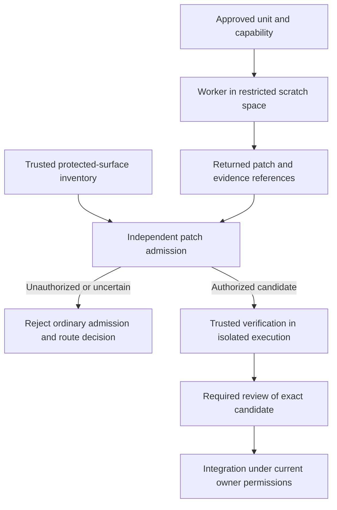

# RePark — production focus, performance, and unsafe Rust safeguards

**Opened:** 2026-09-04. **Class:** campaign. **State:** proposal; implementation scope audit pending.

**Purpose:** preserve the project feedback, performance assessment, possible unsafe Rust path,
and agent safeguards discussed after the SEPMO efficiency review. This is an intake and pickup
reference for later implementation.

**Retires:** promote this brief to the mid-term roadmap when an intake evaluates it. Freeze and
archive it when accepted successor charters or recorded decisions account for every proposal
and open decision below. Link those successors from the archived record. Follow the document
lifecycle in [AGENTS.md](../../../AGENTS.md#markdown-document-lifecycle).

The owner requested that these suggestions be documented before further discussion. Recording
them does not authorize unsafe code, change model permissions, amend the release roadmap, or
relax an existing gate. The authority chain remains in
[AGENTS.md](../../../AGENTS.md#precedence). Current rules apply until deliberately amended.

This brief complements the [Rust unification brief](rust-unification-implementation-brief-2026-09-04.md)
and the [SEPMO efficiency brief](sepmo-efficiency-implementation-brief-2026-09-04.md). Product
unification remains in the first; process efficiency remains in the second. This document owns
the additional recommendations from the subsequent discussion. It is not mandatory startup
reading for every implementation agent.

Quick navigation: [pickup](#1-read-this-at-pickup), [project feedback](#3-product-and-production-feedback),
[performance](#5-performance-opportunities), [unsafe Rust](#7-position-on-unsafe-rust),
[agent permissions](#10-agent-capabilities), [enforcement](#12-worker-isolation-and-patch-admission),
[guard tests](#14-tests-for-the-agent-safeguards), [delivery sequence](#15-recommended-delivery-sequence).

> **Reconciliation note (2026-09-06, orchestrator):** the perf slate that followed this brief has landed on main since it was written — PERF-ICE-CATALOG-IO-1/2/3 (session metadata cache; the fork's shared manifest cache, on by default at 32 MiB after fork F-CATIO-KEY), PERF-ICE-WRITEPATH-1 (parallel CTAS writers), PERF-AGG-AVG-1 (a `GroupsAccumulator` for avg/try_avg), PERF-FACADE-1 and PERF-FACADE-CDF-1 (collect and createDataFrame), PERF-DYNFLATTEN-2, PERF-ICE-SCAN-1 (count(*) folds; parallel small-table scans, fork F-27) and PERF-APPROXPCT-1 (Greenwald-Khanna `percentile_approx`, in review). Read the candidate rows P-2 to P-5 below against `docs/perf/engine-iceberg-analysis-2026-09-04.md` and the registry's `PERF-*` rows before reopening any of them; the brief's text is preserved as written.

## 1. Read this at pickup

1. Follow the current contributor read path. Inspect the checkout and preserve work in flight.
2. Read [STATUS.md](../../../STATUS.md), the
   [release roadmap](release-roadmap-2026-08-29.md), and the
   [ordered queue](../../../briefs/next-sequence.md). Reconcile the applicable changes since §2.
3. Select a bounded objective from §15. Safe performance work does not depend on permitting unsafe.
4. Read the owning code, directory maps, measurement records, and applicable contracts. Treat
   the dated findings here as leads to verify.
5. If agent isolation is in scope, inspect the actual launcher, credentials, tools, filesystem
   access, and integration path. A skill's description is not an isolation test.
6. If unsafe is in scope, resolve the policy and enforcement decisions before changing code.
   Verify that a named exception is authorized and that the gates enforce its boundary.
7. Create the unit's scope audit and acceptance evidence through the current
   [SEPMO process](../../../.agents/skills/sepmo/unit-runbook.md). This brief is not a passed audit.

Recommended starting work is a quiet-machine performance baseline and a separate inventory of
worker permissions and protected code. These establish facts without relaxing current rules.

## 2. Evidence and decision status

Repository inspection for the discussion and this document used checkout HEAD
`671a714421c7294ca0296ef7c8c866d143744526` on **2026-09-04**. The reviewed performance reports
have their own versions and environments. Keep those distinctions when citing them.

**Publication update, 2026-09-04:** the PR base is
`897151dde186f531ba81f503f5a5ddf5eb728b8f`. The original nested-null candidate in P-1 has
landed; its before/after evidence is in the flatten report linked there. A subsequent
[query-engine and Iceberg analysis](../../../docs/perf/engine-iceberg-analysis-2026-09-04.md)
also provides measurements and a candidate slate. Reconcile P-2 through P-5 with that analysis
before commissioning new work. The inspection record below describes the earlier discussion;
it is not a claim that the repository stopped changing at that revision.

| Category | Status at this document's creation |
|---|---|
| JVM-free production requirement | Owner-confirmed; recorded in the Rust unification brief |
| Project and performance feedback | Recommendations based on current documents, selected code paths, and existing measurements |
| New performance experiments | None run for these discussion turns; no new speedup demonstrated |
| Unsafe outside the Python binding | Prohibited by the current contributor contract and lint policy |
| Narrow unsafe exceptions | Discussed as a possible future policy; none granted by this brief |
| Agent capabilities and admission gates below | Proposed controls; not implemented or verified by this document |
| GLM worker isolation concern | A documented limitation in the inspected host-local skill; no new launcher penetration test performed |

No project-wide speedup, full memory bound, complete Spark parity, or new production-readiness
certification follows from this review. The recommendations name what evidence would support
those claims.

## 3. Product and production feedback

### 3.1 Anchor expansion in actual workflows

RePark has a coherent foundation: DataFusion and Arrow, shared Iceberg machinery, distinct SQL
dialects, and thin Python bindings. Protect that foundation as the roadmap expands.

The [year-one intent](../../../PROJECT.md#year-one) names Airflow, Iceberg, SQL, and dbt as the
operating context. Use representative pipelines from that context to rank additions. Each new
capability should identify the workload it makes possible, simpler, or materially faster.

Keep the broader unification direction. Avoid treating SQL, Spark parity, TA, ML, inference,
Excel, connectors, streaming, and server protocols as equally urgent expansion tracks. Their
priority should follow a demonstrated workload need and the current owner's roadmap decisions.

### 3.2 Prioritize silent wrong results

Rank correctness work by consequence, frequency, and exposure in real pipelines. Supported-name
counts are useful inventory, but do not establish that an entire migration preserves results.

The recorded default-window behavior for tied ordering keys is a concrete example. On
2026-09-04, registry row `EX-WIN-1` described a common running-sum expression that differs from
Spark. Its current status and evidence belong in the
[divergence registry](../../../docs/spark-sql-iceberg-parity.md). Recheck that row before scoping
work; this document does not create a second defect queue.

Add representative pipeline completion and result comparison to the public-function coverage
view. Prioritize a plausible but wrong answer over convenience breadth when the affected
workload makes that risk material.

### 3.3 Strengthen the meaning of a stable API

The inspected [versioning policy](../../../docs/release.md#versioning-policy) focuses on names
and required parameters. Propose an explicit policy for behavior users also depend on: result
types, null handling, timezone interpretation, defaults, errors, and write semantics.

Define how correctness fixes that change results are communicated and released. Preserve the
ability to fix wrong answers promptly. Give users examples that explain changed output and
the applicable compatibility decision. Any amendment must remain consistent with the frozen
inventory and current release contract.

### 3.4 Treat resource behavior and recovery as user-facing features

Specify which allocations a configured memory limit covers, which operators spill, which fail,
and what happens when temporary storage fills. The current memory limitations remain recorded
in [STATUS.md](../../../STATUS.md#deferred-capabilities).

Give writes explicit outcomes for cancellation, timeouts, conflicts, and lost connections.
An interrupted caller may not know whether a commit succeeded. Diagnostics should identify the
operation, table, relevant snapshot or commit identity, and a safe next action.

Iceberg provides atomic table commits and optimistic concurrency. RePark must separately define
application retry behavior, checkpoint recovery, and any guarantees across multiple tables.
The format's table-level commit mechanism alone does not define a multi-table database-source
transaction. [Iceberg reliability documentation](https://iceberg.apache.org/docs/latest/reliability/).

### 3.5 Maintain the owned fork as a second product

Reserve engineering capacity for dependency upgrades, interoperability, release compatibility,
and regression diagnosis across RePark and its owned Iceberg fork. Verify supported combinations
of engine version, fork revision, table format, and external writers.

Include upgrade scenarios and state when rollback is unsupported. Keep fork capability facts
in the fork's authoritative documents, reached through
[ADR-0001](../../../docs/adr/0001-own-iceberg-fork.md). Public RePark summaries should derive from
that evidence and RePark integration tests.

### 3.6 Shorten the first successful user experience

Lead user onboarding with installation, a local query, and an Iceberg write, followed by catalog
configuration and migration guidance. The contributor read path should remain easy to find.
The existing entry point is [Getting started](../../../docs/guide/getting-started.md).

Exercise that path from the released wheel in a clean environment without Java. Ask a small
number of engineers to follow it without coaching. Record installation failures, confusing
configuration, time to first useful result, and missing diagnostics.

A future migration assessment tool could report known unsupported functions, configuration
differences, and semantic risks before a pipeline is moved. Clearly distinguish what static
inspection establishes from what requires planning or execution. Do not silently execute a
pipeline's writes to assess compatibility.

## 4. Make the public promises testable

| Promise | Proposed definition work |
|---|---|
| Production-grade Iceberg | Publish the tested operations, catalogs, format versions, concurrency conditions, and declared limitations from existing evidence |
| Reproducibility | Separate equivalent values, deterministic row ordering, and byte-identical serialized artifacts; define the inputs and scope of each guarantee |
| Zero-copy interchange | Name the supported representations and boundaries, and document conversions that allocate |
| Fast startup | Distinguish import, session construction, first local query, and first remote-catalog operation; measure cold and warm conditions |
| Predictable resource use | Define accounted memory, spill behavior, disk limits, concurrency, and failure outcomes |
| Spark migration | State the supported version and semantic conditions; measure complete representative workflows |

The reproducibility goal in [PROJECT.md](../../../PROJECT.md) needs more inputs than a query and
snapshot alone. Pin the relevant engine version, configuration, timezone, function versions,
and nondeterministic inputs. Explicitly define row-order requirements and tie handling. Ordinary
SQL does not guarantee output order without ordering; see the
[PostgreSQL ordering documentation](https://www.postgresql.org/docs/current/queries-order.html).
Byte-identical files additionally need a serialization and metadata contract.

Preserve the existing bit-exact TA contract. Clarifying general query reproducibility does not
relax the numeric guarantees already attached to those kernels.

Arrow supports efficient buffer interchange, but conversions can allocate. For example, its
documentation describes restrictions on zero-copy conversion to pandas. Avoid presenting a
zero-copy engine boundary as a promise about every downstream representation.
[Arrow memory documentation](https://arrow.apache.org/docs/python/pandas.html#memory-usage-and-zero-copy).

## 5. Performance opportunities

There is credible, uneven headroom. Separate measured bottlenecks, inspected allocation costs,
historical comparisons, and untested hypotheses. None implies a universal speedup multiplier.

### P-1. Null-heavy nested structures — original candidate delivered

The [2026-09-04 flatten report](../../../docs/perf/dynamic-flatten-baseline.md) is the evidence
home. At 100,000 rows and eight partitions, its deep-structure fixture recorded 66.7 ms with
30 percent null parents and 6.7 ms without null parents. The isolated difference was 59.98 ms.

The recorded spread of repeated medians was 10.81 ms. The report's 5.5-times figure compares
the isolated cost with that spread; it is not a speedup estimate or a confidence interval.
The host had competing work. The report does not qualify as a release-gating baseline.

At the discussion revision, the field construction built a parent-null conditional around
each extracted field. That observation motivated a safe Arrow optimization candidate.

By publication, PERF-DYNFLATTEN-2 has delivered the replacement. Its separate before/after
run and remaining limitations are recorded in the report's
[after section](../../../docs/perf/dynamic-flatten-baseline.md#after-perf-dynflatten-2--the-null-mask-struct-extractor).
Do not reopen the original candidate from this brief. Scope any residual null-semantics work
against the current registry and ordered queue.

The null-free fixture is an isolation control. Null propagation still requires work, so its
timing did not establish an attainable target for the null-containing case. Use the delivered
unit's paired measurements to assess its improvement; do not combine the two runs' noise floors.

### P-2. TA output copies

The inspected [TA UDF implementation](../../../crates/repark-ta/src/udf/mod.rs) clones a
`Vec<f64>` on a multi-output cache hit and then copies its contents into an Arrow builder.
The initial multi-output calculation also clones the selected band before Arrow construction.

Evaluate ownership transfer and shared completed Arrow arrays. Arrow supports constructing
buffers from owned vectors without copying, which provides a plausible safe implementation
path. [Arrow Rust array documentation](https://arrow.apache.org/rust/arrow_array/index.html).

No timing or allocation-volume saving has been measured for that change. First profile wide
multi-indicator queries and the actual serving shapes. Distinguish payload copies from cheap
reference-counted clones. Preserve each kernel's arithmetic order and bit-exact results.

The [TA map](../../../crates/repark-ta/map.md) records a cache-identity limitation. Resolve its
current status before changing cache ownership, lifetime, or reuse. Performance work must not
preserve or widen an invalid reuse assumption.

### P-3. Percentile representation and selection

The inspected [percentile implementation](../../../crates/repark-functions/src/percentile_approx.rs)
stores group elements as individual `ScalarValue`s, then clones the collection before rank
selection. Registry row `PERF-APPROXPCT-1` records the whole-group memory behavior in the
[divergence registry](../../../docs/spark-sql-iceberg-parity.md).

Typed storage and selection workspaces are candidates for reducing representation and copying
costs. Measure group size, group count, skew, state merging, and peak memory. Preserve the
declared discrete-value semantics, types, null behavior, and numeric precision.

An approximate sketch changes the behavior that the current implementation deliberately keeps.
It is not a drop-in performance fix. Spill or external selection would need a separate design
if large-group memory remains the limiting factor.

### P-4. Batch and parallelism configuration

The flatten report found that the machine's 64-thread default was frequently slower than the
eight-partition configuration on its measured shapes. This is a tuning lead, not evidence that
eight is the correct universal setting.

Benchmark partitions, batch size, scan concurrency, and write concurrency against workload size,
skew, memory pressure, and hardware. Test single queries and concurrent queries. Preserve the
current configuration ownership and precedence rules. Avoid changing a default based on one
busy machine or one small workload.

### P-5. Window execution

The [2026-08-31 window report](../../window-bench-report-2026-08-31.md) used RePark v0.5.0. Its
million-row sliding-sum cell recorded 564.9 ms for RePark and 75.5 ms for DuckDB on that setup.
These are historical observations, not a measurement of the current release or proof that the
gap is recoverable.

Repeat comparable supported window shapes on the current release. Verify values and types,
inspect sorts and repartitioning, and record engine settings and thread counts. The old
over-memory tests failed in sorting before the window; they did not establish window spill
behavior. Preserve that distinction when designing the next experiment.

### Already-good paths and rejected leads

The inspected [Python Arrow export](../../../crates/repark-python/src/dataframe.rs) already
opens a lazy batch stream and releases the GIL during physical-plan construction. TA already
borrows suitable null-free input buffers and shares multi-output computation.

The flatten report measured schema-rewrite work at fractions of a millisecond and explicitly
declined an optimizer-walk implementation unit. Do not revive that unit from code appearance.
Sequential list expansion also cannot be replaced with zip/pad semantics to improve a timing.

Some Iceberg manifest work has already been fixed, and the suspected triple scan was refuted
on the measured production path. Recheck `PERF-DVCLOSE-*` and `PERF-SCAN-3PASS-1` in the
[existing record](../../../docs/spark-sql-iceberg-parity.md) before naming remaining opportunities.

## 6. Performance measurement and acceptance

Use three representative production pipelines as an end-to-end reference set. Candidate examples
are an Iceberg SQL transformation, a Spark-facade migration with windows or nested input, and
a TA serving workload. Select actual shapes and data distributions during intake.

For each candidate optimization:

1. Verify the current implementation and record its release profile, source, dependency pins,
   hardware, configuration, input shape, and result contract.
2. Establish a quiet-machine baseline with repeated runs. Separate cold and warm conditions.
3. Use profiling and, where relevant, generated-code inspection to locate the actual cost.
4. Implement the smallest semantics-preserving change with the existing required tests.
5. Compare results, allocations, peak memory, and elapsed time on identical inputs and settings.
6. Measure the complete affected operation and representative pipeline. Keep unsuccessful or
   neutral experiments in the evidence rather than selecting only favorable results.

For Iceberg workloads, also record metadata planning, object-store requests, bytes read, files
created, time to durable visibility, retries, and resulting maintenance work. For resource tests,
include behavior beyond configured memory and disk limits.

Observe the repository's disk and artifact rules before builds and large experiments. Keep
required evidence in a durable indexed location and clean up task-owned scratch data. A noisy
or incomplete experiment must be reported with that limitation.

P-1's original candidate is delivered. Reconcile P-2 and P-3 with the later analysis in §2,
then baseline any remaining candidate. Configuration experiments can proceed as separate
bounded work. Remeasure windows before designing a replacement or specialization.

## 7. Position on unsafe Rust

Selective unsafe Rust is a possible future optimization tool. It remains Rust and does not add
a JVM requirement. An exception should demonstrate a meaningful benefit over the best safe
implementation and carry a small, inspectable safety contract.

Polars provides a concrete example: its primitive gather kernel uses unchecked indexing and
requires callers to establish that indices are in bounds. That is a specific operation with a
specific obligation, not a reason to make the whole engine permissive.
[Polars primitive gather implementation](https://github.com/pola-rs/polars/blob/main/crates/polars-compute/src/gather/primitive.rs).

RePark already benefits from safe library APIs whose internals may contain unsafe code. Its
local lint ban does not prohibit unsafe inside dependencies. Prefer existing safe interfaces
when they provide the required performance and semantics.

Polars' performance improvements also include fewer allocations, specialized decoding, and
eliminating repeated work. Its 1.41 announcement illustrates that wider optimization approach;
it does not establish a RePark speedup.
[Polars 1.41 announcement](https://pola.rs/posts/polars-1-41/).

### Candidate boundaries

| Area | Proposed position |
|---|---|
| Null masks and nested-field extraction | Investigate safe Arrow operations first; consider a narrow exception only for a demonstrated remaining cost |
| Gather and selected-value copying | Potential candidate when bounds can be established once and reused; inspect existing library kernels first |
| Explicit SIMD | Consider suitable bitmap, comparison, or independent-series operations after inspecting compiler output |
| TA output copies | Ownership and buffer sharing work should start in safe Rust |
| Percentile storage | Representation and allocation improvements should start in safe Rust |
| Catalogs, commits, session state, recovery | Keep the current prohibition; this review found no profiling basis for an exception |

For TA, preserve each series' arithmetic order. Vectorizing independent series may fit that
constraint. Reassociation or fused operations can change bits and require a different semantic
decision; they are not implicitly allowed by an unsafe exception.

## 8. Current prohibition and amendment boundary

As inspected on 2026-09-04, [AGENTS.md](../../../AGENTS.md) and the
[workspace manifest](../../../Cargo.toml) forbid unsafe outside the existing
[Python binding exception](../../../crates/repark-python/Cargo.toml).
[PROJECT.md](../../../PROJECT.md) anticipates a last-resort exception supported by profiling,
Miri, and fuzzing. The authoritative current prohibition still governs implementation.

Keep the default prohibition in ordinary crates. If an exception is later approved, choose the
smallest enforceable kernel boundary when its implementation arrives. A private kernel crate
may be appropriate if it materially improves enforceability. Do not scaffold a speculative crate.

An inline `allow` cannot relax an enclosing `forbid`. The actual crate and module lint wiring
must be part of the amendment. Verification must also control compiler flags and configuration
that could cap or otherwise weaken diagnostics. See the
[Rust lint-level documentation](https://doc.rust-lang.org/rustc/lints/levels.html).

The amendment must reconcile the engineering contract, manifests, affected maps, required
safety documentation and comment gates, review rules, worker capabilities, and CI enforcement.
Portable SEPMO changes follow its master-canon amendment route. Project-specific restrictions
belong in the RePark contract and binding.

## 9. Admission standard for one unsafe exception

Require all of the following before accepting an implementation:

- A named bottleneck and a reproducible comparison against the best safe implementation.
  A flamegraph alone does not establish that bounds checks cause the cost.
- A small safe public interface. Safe callers cannot trigger undefined behavior with any
  input accepted by that interface. Validate inputs or construct checked private types that
  carry the necessary guarantees.
- Written invariants for bounds, initialization, aliasing, alignment, lifetime, ownership,
  error cleanup, and any CPU feature requirement. Each unsafe operation cites the relevant
  argument and the code that establishes it.
- A retained safe reference and differential tests for values, types, nulls, slices, offsets,
  empty inputs, boundary lengths, and relevant numeric extremes.
- Fuzzing, Miri where supported, and native tests for the supported target and feature matrix.
  An unsupported Miri operation needs explicit alternative evidence; it is not silently skipped.
- Required existing entry-point tests and gates, plus a separate safety review of the final
  candidate and a meaningful benefit on the affected workload.

Require explicit unsafe blocks inside unsafe functions through `unsafe_op_in_unsafe_fn`, with
the chosen severity enforced by the approved gate configuration.
[Rust Edition Guide](https://doc.rust-lang.org/edition-guide/rust-2024/unsafe-op-in-unsafe-fn.html).

A sound safe wrapper is essential. A small unsafe module is easier to inspect, but it is not a
fault-containment boundary: a memory error can affect the entire process.
[Rustonomicon](https://doc.rust-lang.org/stable/nomicon/safe-unsafe-meaning.html).

Testing supports the safety argument; it does not prove soundness for every execution. Keep
Miri's coverage and execution limitations explicit.
[Miri documentation](https://github.com/rust-lang/miri).

## 10. Agent capabilities

Assign capabilities per run through a trusted launcher. Model selection is an operating choice;
it is not proof of authorization or correctness. An agent cannot elevate its permissions by
changing its claimed model, role, or hand-back status.

| Role | Permitted work | Restriction |
|---|---|---|
| Ordinary worker, including GLM 5.3 Flash | Bounded changes through existing safe APIs, ordinary tests, and non-protected documentation | Cannot change protected implementations, invariants, safety evidence, or enforcement configuration |
| Authorized unsafe implementer | One explicitly approved kernel and its scoped supporting changes | Cannot widen its own scope, grant exceptions, or approve its own work |
| Independent safety reviewer | Inspect the final implementation, invariants, and evidence; propose adversarial cases | Cannot silently repair the candidate during review |
| Orchestrator | Assign approved work, check admission, assemble evidence, and route blockers | Cannot infer new unsafe authority from a worker's request or a green test run |
| Owner | Decide exceptions and final integration under the current contract | Existing repository approval boundaries continue to apply |

The launcher should record the task, capability, base revision, allowed changes, protected
inventory version, required checks, and authorization reference outside the worker's writable
environment. Commit, push, and integration authority remain governed by existing explicit
authorization. A worker's assignment does not imply any of those permissions.

Keep ordinary task packets small. They need the safe interface, allowed scope, and escalation
conditions. Detailed unsafe proof records go to the implementer and reviewer responsible for
that boundary. This connects the safeguards to the existing SEPMO efficiency proposal.

## 11. Protect the complete invariant boundary

Protect more than files containing the `unsafe` keyword. A change to safe code can invalidate
an assumption used by an unsafe operation. The Rustonomicon demonstrates this directly.
[Working with unsafe](https://doc.rust-lang.org/nomicon/working-with-unsafe.html).

| Protected surface | Reason |
|---|---|
| Unsafe implementation and safe wrapper | Together they establish what safe callers can do |
| Constructors, validators, and private invariant-bearing state | A safe edit can remove the guarantee relied upon by unchecked operations |
| Ownership, layout, and lifetime helpers | Reallocation, aliasing, or changed cleanup can invalidate pointers and initialized ranges |
| Safety tests, fixtures, and safe reference implementation | An implementation must not weaken the evidence that judges it |
| Relevant dependency, feature, target, macro, and build configuration | Behavior and compiled paths can change without modifying the unsafe block |
| Policy, lint settings, launcher configuration, admission tools, and CI | The worker must not change the mechanism that restricts its patch |
| Existing handwritten FFI and its supporting invariants | The Python binding exception must not become an alternative home for unauthorized unsafe work |

Build the initial inventory from the real call and dependency paths. Store it in one approved
home and check changes against a trusted version. A hash detects a changed input; it does not
establish that the inventory is complete.

If classification is uncertain, reject admission to the ordinary lane and route the decision to
the authorized review path. A one-line change, formatting label, unchanged unsafe-block count,
or passing test suite cannot exempt a protected change.

Prefer safe interfaces that enforce invariants and private fields that prevent external mutation.
This reduces the amount of surrounding code that must be protected. A wrapper that merely hides
the unsafe keyword without validating its assumptions is not a sound boundary.

## 12. Worker isolation and patch admission

### Documented starting gap

The inspected host-local `oc-worker` skill, section
"Gaps vs grok-worker", records no OS-level bwrap sandbox and notes that shell commands can
escape command-denial globs. It describes scratch clones, deny rules, and orchestrator review
as mitigations. This is a dated documentation observation, not a fresh test of the launcher.

Re-resolve that host-local path and inspect the implementation at pickup. The permission rules
and any future controls must be verified against the actual worker tools and filesystem.

### Proposed execution boundary

Use an OS-enforced sandbox with protected inputs mounted read-only, or a trusted patch service
that applies only approved changes. An editor's deny-write setting is insufficient when another
tool can write the same files. A patch service must run the worker in scratch space without
write access to the original checkout or the service's control files.

Keep the launcher, authorization record, admission checker, and trusted policy outside the
worker's writable environment. Do not expose integration credentials or host control sockets.
Use narrowly scoped writable areas for builds, tests, and hand-back artifacts. Test the real
boundary; same-user file permissions or command patterns alone do not establish it.

### Proposed admission flow

The trusted checker compares the candidate against the authorized base and scope. Include added
and deleted files, renames, file modes, symlinks, and relevant untracked inputs. Normalize paths
and reject unexpected changes or ambiguous resolution.

Run the checker from a trusted version. Candidate changes to the checker, policy inventory, or
workflow cannot authorize themselves. Control relevant compiler configuration and invocation;
a worker's local success report is not sufficient verification evidence.

Use syntax-aware inspection and compilation across supported configurations. Keyword scans
are useful leads, but miss safe invariant changes and can misclassify comments. Compilation of
one feature set does not establish coverage of inactive conditional code or every macro path.
Document the supported coverage and conservatively route changes outside it.

Verification executes candidate code and build scripts in an isolated environment without
privileged credentials. Trusted policy selection must not become privileged execution of the
candidate. Existing restrictions on unmerged code and live AWS remain in force.

## 13. Review and integration

Route every protected-surface change to the proposed HIGH-risk path, even if the change is
syntactically safe Rust. Retain the current SEPMO lifecycle, taxonomy, and required checks until
an amendment changes their homes.

Separate implementation and safety review. Use a fresh reviewer context when authorized;
preserve the existing delegation policy. The reviewer must inspect the invariants, not rely on
the implementer's confidence, model name, or a checklist alone. Remediation returns to the
implementer, followed by review of the changed candidate.

Bind evidence and approvals to the actual candidate source identity and relevant configuration.
Later changes invalidate affected evidence. Review the final integration candidate when it
differs from the reviewed branch. Missing or stale evidence blocks integration.

Required checks, code-owner review, and dismissal of stale approvals can enforce part of this
boundary on GitHub. Verify the actual repository settings and bypass permissions; a CODEOWNERS
file by itself does not require approval.
[GitHub protected branches](https://docs.github.com/en/repositories/configuring-branches-and-merges-in-your-repository/managing-protected-branches/about-protected-branches).

No arrangement guarantees defect-free code. The objective is to make unauthorized ordinary-worker
changes inadmissible and provide stronger evidence for the few authorized exceptions.

## 14. Tests for the agent safeguards

Implement and run these checks before granting the first unsafe exception. Use controlled
fixtures and task-owned scratch environments. Test actual enforcement, not just prompt responses.

| Attempt | Required observation |
|---|---|
| Add unsafe outside an approved boundary | Compilation or admission rejects it under trusted policy |
| Remove a bounds check without changing an unsafe block | Protected-surface admission rejects the ordinary-worker patch |
| Change ownership or permit buffer reallocation beneath a kernel | The invariant-bearing change requires the authorized review path |
| Add handwritten unsafe through the existing Python FFI exception | Admission rejects the unauthorized change |
| Write a protected file through shell or another available tool | The claimed filesystem boundary denies the write; accepted patches also remain checked |
| Weaken Cargo lints or relevant compiler configuration | Admission or trusted verification rejects the attempt |
| Replace the checker, policy inventory, or workflow | Candidate changes cannot approve themselves |
| Hide a change behind a rename, symlink, new file, or inactive feature | Admission rejects it or explicitly routes it for supported-configuration review |
| Remove a safety test or alter expected reference results | The evidence change is protected and cannot be admitted as ordinary work |
| Claim a stronger model or privileged role in the hand-back | The trusted capability record remains authoritative |
| Modify the candidate after review | Previous affected checks and approvals no longer establish readiness |
| Supply a green summary without valid artifacts | Readiness fails on missing or mismatched evidence |

Record the command or operation, expected decision, actual decision, and source identity. A guard
that accepts one of the forbidden mutations remains unready. Keep a positive case showing that
an authorized ordinary patch still passes, so the boundary does not simply reject all work.

## 15. Recommended delivery sequence

Each row is a candidate package, not an authorized implementation unit. Select its exact paths,
acceptance cases, dependencies, and required approvals during scope audit.

| Package | Deliverable | Dependency or boundary |
|---|---|---|
| R-0: Representative workflows | Three real pipeline shapes, expected results, configuration, and operational acceptance criteria | Reconcile with the existing roadmap and product brief |
| P-0: Current performance baseline | Quiet-machine release measurements and profiles for the selected safe optimization candidates | Existing measurements are leads; no unsafe permission needed |
| P-1: Safe optimization units | Independently measured remaining TA buffer, percentile, or configuration improvements | Reconcile delivered work and the later analysis first; preserve semantic contracts |
| G-0: Worker and invariant inventory | Actual launcher capabilities, protected surfaces, trusted policy source, and capability schema | Read-only discovery; keep unsafe prohibited |
| G-1: Isolation and patch admission | Enforced worker boundary and trusted candidate checker | G-0; no unsafe exception yet |
| G-2: Guard verification | Passing rejection and positive-control cases from §14 | G-1; failures block unsafe admission |
| U-0: Exception policy | One approved boundary, lint wiring, safety documentation, review rules, and integration enforcement | A profiled need, G-2, and explicit policy approval |
| U-1: First kernel experiment | Safe reference, unsafe candidate, soundness argument, tests, and workload comparison | U-0; no automatic expansion to other kernels |
| R-1: User contract and onboarding | Supported-workflow view, behavioral compatibility policy proposal, and clean-install exercises | Use evidence from R-0 and the current release; deliberate contract amendments where needed |
| Close-out | Adoption or rejection of each proposal, current authoritative sources, and archived evidence | Follow the existing document and unit lifecycle |

Performance work can proceed while the agent safeguards are developed. Unsafe implementation
must wait for its policy and enforcement dependencies. A neutral measurement change must not
carry an unreviewed relaxation of safety rules.

Likely change homes are the current contributor contract, existing component code and maps,
worker adapters and launchers, verification scripts, SEPMO binding, and applicable CI settings.
This document does not create any of those changes or select new crate boundaries in advance.

## 16. Decisions required during intake

| Decision | Recommended starting position |
|---|---|
| Which workloads anchor the next milestone? | Choose three real pipelines with verified expected results and operating limits |
| Which candidate is first? | Remeasure the nested-null candidate; profile TA copies and percentile representation next |
| What performance gain justifies unsafe maintenance? | Predeclare a workload-relevant threshold above measurement noise after establishing the baseline |
| What constitutes the strongest safe implementation? | Review available library kernels, ownership transfer, layout, and compiler output |
| Where is the smallest enforceable unsafe boundary? | Decide when a real kernel needs it; preserve the default prohibition elsewhere |
| Which safe helpers and configuration belong to its protected boundary? | Inspect invariants and dependency paths; route uncertainty conservatively |
| Which worker interfaces and hosts need isolation? | Inventory the ones actually used, including every write-capable tool |
| Who grants run capabilities and owns integration credentials? | A trusted launcher and the existing owner-controlled integration path |
| How are Miri or target-coverage limitations handled? | Require explicit alternative evidence and a reviewed supported-target scope |
| How do safety annotations fit current comment rules? | Reconcile required documentation and its gates in the explicit policy amendment |
| How are behavior-changing correctness fixes released? | Deliberately extend the versioning policy with examples and compatibility decisions |
| What rejects or retires an unsafe optimization? | Missing soundness evidence, guard failure, semantic regression, or insufficient measured benefit |

## 17. Source and handoff notes

The repository links above point to the homes of current facts. External primary sources are
linked beside the technical recommendations they support. They were consulted for the
2026-09-04 discussion; verify current API details before implementation.

The host-local worker skill is machine-specific. Its observed limitation must be rechecked on
the host that will execute a future unit. No worker was launched, no isolation control was
changed, and no unsafe code was introduced while preparing this brief.

At the next pickup, update only the applicable proposal state or promote accepted decisions to
their authoritative homes. Keep current capability and defect status in their existing records.
Archive the completed proposal when its retirement condition is met.
