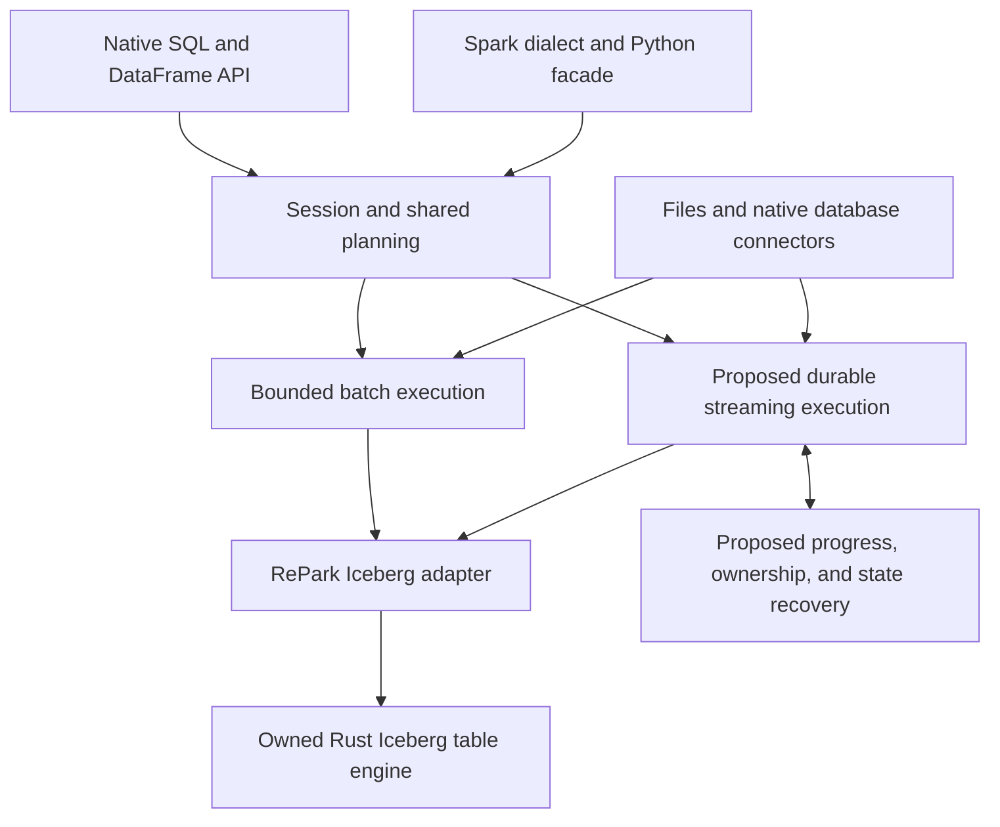

# Rust unification — implementation brief

**Opened:** 2026-09-04. **Class:** campaign. **State:** proposal; implementation scope audit pending.

**Purpose:** preserve the product direction, engineering recommendations, and next steps from
the owner's 2026-09-04 discussion. This is the pickup document for turning that direction into
audited implementation units. It contains no claim that the proposed capabilities are built.

**Retires:** promote this brief to the mid-term roadmap when an intake evaluates it. Freeze and
archive it when accepted charters and the amended release roadmap account for every proposal and
open decision below. Link those successors from the archived record. Use the document lifecycle
in [AGENTS.md](../../../AGENTS.md#markdown-document-lifecycle).

The production runtime constraint in §1 is owner-confirmed. The sequence, initial scope, and
design candidates below are recommendations. Saving this brief does not approve an implementation
charter, change a release commitment, or authorize a commit, push, deployment, or AWS mutation.
The contributor contract and approval boundaries remain in [AGENTS.md](../../../AGENTS.md).

Quick navigation: [pickup](#2-read-this-at-pickup), [architecture](#5-architecture-to-develop),
[measurements](#6-performance-and-memory-work), [first pipeline](#7-first-pipeline-milestone),
[recovery](#8-durable-progress-and-iceberg-output), [delivery groups](#11-recommended-delivery-groups),
[open decisions](#12-decisions-required-during-intake), [proof requirements](#13-proof-and-handoff-requirements).

## 1. Product direction and confirmed production constraint

The owner wants the useful capabilities of Polars, DuckDB, PySpark, Spark Structured Streaming,
Debezium for PostgreSQL and SQL Server, and potentially a small Flink-like runtime. RePark must
combine them with ease of use, high speed, and full production-grade Iceberg support.

The owner clarified the deployment requirement on 2026-09-04:

> The goal is pure Rust wrapped to Python, I don’t want a single JVM overhead to maintain for production

The production design therefore includes a Rust engine, Rust database connectors, Rust streaming
and recovery machinery, and thin Python bindings. It requires no Spark cluster, Flink service,
Debezium service, Kafka Connect deployment, or other JVM component. An external Debezium service
is not the proposed production path.

Those systems remain useful behavioral references. Existing development-only oracle workflows
remain governed by [docs/testing.md](../../../docs/testing.md). A JVM used to record test evidence
must not become an installation, execution, restart, or maintenance dependency for users.

Audit the transitive dependencies and enabled features of proposed drivers, state stores,
compression libraries, and transport libraries. A Rust API does not establish that its backing
engine is Rust. Preserve the intended Python/CPython binding boundary; do not introduce a C++
compute or state engine under a Rust wrapper and claim it satisfies the product direction.
Record any dependency-boundary ambiguity before selecting that dependency.

Existing architectural constraints have their single home in
[PROJECT.md](../../../PROJECT.md) and [AGENTS.md](../../../AGENTS.md). This proposal builds on
them: DataFusion and Arrow, the owned Iceberg fork, the two SQL doors, and session-owned policy.

## 2. Read this at pickup

1. Follow [AGENTS.md's read path](../../../AGENTS.md#read-first), then read this document.
2. Read [STATUS.md](../../../STATUS.md) for current delivery state. Do not use this dated brief
   as a substitute for it.
3. Read the [release roadmap](release-roadmap-2026-08-29.md),
   [design cards](roadmap-design-plan-2026-08-29.md), and
   [ordered queue](../../../briefs/next-sequence.md).
4. Inspect the current checkout, uncommitted work, and relevant merged changes. Reconcile only
   the applicable delta through the existing pickup procedure. Preserve other work in flight.
5. Resolve the decisions required by the first unit in §12. Turn that unit's scope into an
   enumerated proposition ledger through [SEPMO](../../../.agents/skills/sepmo/SKILL.md).
6. Bind acceptance tests, actual implementation paths, dependencies, and verification commands
   before implementation. Read the affected directories' maps. Apply the engineering and
   language-specific skills required by the contract.

**Recommended next milestone:** a dependable PostgreSQL → RePark → Iceberg pipeline, supported
by measured batch performance and memory behavior. **Recommended first engineering unit:** the
applicable H-3 measurement work after the scope and roadmap reconciliation.

This is a proposal-stage handoff. No scope audit has passed for the new streaming or CDC work.
No performance baseline, runtime feasibility result, or production acceptance run was produced
by the discussion that created this brief. Keep open decisions open until evidence resolves them.

**Publication update, 2026-09-04:** the PR base is
`897151dde186f531ba81f503f5a5ddf5eb728b8f`. It includes subsequent performance work and an
initial dbt adapter. Use [STATUS.md](../../../STATUS.md) for their current delivery and acceptance
state, and the [later performance analysis](../../../docs/perf/engine-iceberg-analysis-2026-09-04.md)
when selecting measurement work. These merged units do not implement the proposed CDC or
stateful streaming contract. Reconcile them before treating the recommended first unit as new work.

## 3. What each reference system contributes

| Reference | Product capability to pursue | Evidence of success |
|---|---|---|
| Polars | Expressive lazy transformations, efficient columnar execution, file I/O, nested data | Versioned expression/I/O matrix, executable examples, equivalent-result benchmarks |
| DuckDB | Simple installation, convenient SQL, local analytics, predictable operation beyond RAM | Clean-install workflow, SQL benchmarks, memory-pressure outcomes, useful query plans |
| PySpark | Familiar migration surface and verified semantics | Values, Arrow types, nullability, errors, and configuration behavior measured per entry point |
| Structured Streaming | Related batch and streaming APIs, triggers, incremental execution | Supported-operation matrix and restart tests through the public streaming API |
| Debezium | Consistent initial snapshots, change capture, ordering, recovery | Native connector protocol fixtures and source-to-target reconciliation under failures |
| Flink | Event time, durable keyed state, timers, watermarks, backpressure | Late-event and state-recovery tests under bounded resource policies |
| Iceberg | Interoperable storage, commits, evolution, history, and maintenance | Cross-engine read/write/maintenance matrix and catalog-specific failure tests |

Unification requires explicit semantics. A shared function name can have different coercion,
rounding, ordering, timestamp, regular-expression, or error behavior in different systems.
Preserve the native and Spark semantic profiles. Reuse implementations where their contracts
agree. A public export or a permissive fallback does not establish compatibility.

Scope parity against pinned reference versions and finite input partitions. Record supported,
refused, and deliberately different behavior separately. Examples and error paths are product
deliverables alongside the working functions.

## 4. Relationship to the existing roadmap

The mappings below locate work in the roadmap read on 2026-09-04. They do not assign new release
numbers. Re-read the linked source when scheduling units.

| Existing home | Relationship to this proposal |
|---|---|
| H-3 / release 1.3 memory work | Bring the applicable performance and spill measurements forward |
| Configuration cards / release 1.4 | Reuse the Rust-owned configuration and named-source direction for CDC setup |
| Releases 1.7–1.9 | Continue native I/O, Polars expression, and PySpark semantic coverage |
| Release 1.10 | Native database connectivity supplies part of the CDC foundation; query access alone does not prove replication support |
| Releases 1.12 and 2.0 | Share session lifecycle and resource machinery when server protocols arrive |
| Release 1.13 | Multi-writer and REST catalog work remains separate from the proposed initial single-writer CDC contract |
| Release 2.1 | Maintenance policy must protect the replay and recovery needs of active consumers |
| Release 2.2 | Snapshot-based incremental reads are a useful subset; durable stateful streaming requires a wider design |
| Release 2.3 | Native PostgreSQL and SQL Server CDC is the first complete pipeline milestone proposed here |
| Release 2.4 | Incremental materialized views become a later consumer of correct change semantics |
| Release 2.7 | Introduce the operational measurements needed by each earlier unit as that unit lands |
| Release 3.0 | Full multi-user trust remains a larger milestone; remotely exposed servers need baseline authentication and transport protection when introduced |

Three reconciliation items require attention at pickup:

- On 2026-09-04 the ordered queue listed several units that STATUS described as landed. Check
  actual merge evidence before removing or rescheduling any row. Do not repeat completed work.
- Design card 2.2 describes progress as a last-consumed snapshot identifier in a checkpoint file.
  The durable pipeline needs a protocol connecting source progress to committed output (§8).
- Design card 2.2 and placement ruling D-5 mention a future migration away from the owned fork.
  Check that statement against the authoritative fork-ownership contract. This brief does not
  authorize a fork migration or resolve changelog ownership by implication.

The [v1.0 Iceberg acceptance definition](v1-0-iceberg-v3-northstar.md) permits dated declared
exclusions. Reaching that release gate and implementing every feature in the broader vision
are separate claims. Use the existing acceptance definition and divergence registry to decide
which exclusions the future product promise must close; do not duplicate their status here.

## 5. Architecture to develop

### 5.1 Shared engine and explicit execution modes

Keep shared expressions, schemas, source registration, session policy, and Arrow batch handling.
Native SQL, native DataFrames, and the Spark facade remain adapters to engine capabilities with
their declared semantics. Python constructs plans; the engine executes them under the existing
contract, including its explicit UDF exception.

This diagram expresses responsibilities. It does not authorize new crates, a new intermediate
representation, or dependency edges. Bind actual placement through the existing crate DAG and
maps when a concrete driver arrives. Inspect DataFusion's support at the pinned version before
choosing an execution extension. Streaming Arrow batches alone do not establish durable stream
processing.

Share kernels and planning where semantics permit. A bounded sort and an unbounded event-time
window have different completion and state requirements. Classify operators by boundedness,
ordering needs, change behavior, and state requirements before admitting them into streaming plans.

### 5.2 Product experience

Develop the public experience alongside the first complete implementation:

- Lazy scans, transformations, and sinks that avoid collecting intermediate rows in Python.
- Named sources and one configuration model, using the configuration cards' existing design.
- A simple initial-load-and-follow workflow with visible progress, stop, and resume behavior.
- Plans that explain execution and pushdown boundaries.
- Actionable errors that identify the source, table, batch, and recovery action without secrets.
- Executable examples installed and run against the actual packaged wheel.

Record conversion and ownership costs at the Arrow boundary. Claim zero-copy only for paths
where buffer ownership, representation, and lifetime actually allow it.

Keep the embedded batch path convenient. A long-lived sync may require supervision and durable
storage, but it must not require a server-protocol milestone before a local pipeline can run.
Choose its supported launcher during intake; example command names in older cards are design
sketches until implemented and accepted.

## 6. Performance and memory work

Extend the existing [benchmark harness](../../../python/repark-parity/bench/map.md) and
[H-3 specification](../../../briefs/v2-engine-hardening.md#h-3--performance-baseline-measure-before-touching).
The harness, environment manifest, noise measurement, comparison rules, and spill outcomes have
their single home there. Do not introduce a parallel benchmark convention.

### 6.1 Workload roster

| Family | Representative shapes | Measurements that answer a product question |
|---|---|---|
| Local SQL | Scan/filter/aggregate, star joins, sorting, window-heavy queries | Planning and execution time; memory; spill; scaling with rows and width |
| DataFrames | Strings, nested data, inference conflicts, flattening, TA pipelines | End-to-end latency; materialization; allocation and boundary overhead |
| Iceberg | Selective scans, MERGE, UPDATE/DELETE, deletion vectors, maintenance | Bytes and files touched; request count; commit time; write amplification |
| Database snapshots | Narrow/wide tables, large values, skewed partition keys | Rows and bytes per second; source impact; conversion cost; process memory |
| Change capture | Steady changes, bursts, hot keys, large transactions, downtime | Source-to-visible latency; catch-up time; backlog; retained source history |
| Resource pressure | Skewed joins, high-cardinality groups, large windows, exports | Completion/refusal outcome; peak process memory; spill; disk exhaustion behavior |
| Concurrent use | A running sync plus queries and maintenance | Interference; resource fairness; query latency; ingestion lag |

Use synthetic, reproducible data with shapes derived from real workload requirements. Follow
the harness's data provenance rules. Record equivalent results and semantics before comparing
performance across RePark, Polars, DuckDB, or Spark. Separate cold/warm runs and local/object-store
runs. Isolate performance runs from competing builds and other measurements.

### 6.2 Initial decisions and optimization order

Choose the reference hardware, dataset scales, acceptable latency, throughput, memory envelope,
and recovery interval before fixing numerical thresholds. Measure noise before assigning a
regression budget. No date, speedup, universal memory guarantee, or capacity target is committed
by this brief.

Audit process memory beyond DataFusion's pool: decoding, Arrow conversion, writer buffers,
metadata, queues, and future state storage. A pool setting does not establish a process-wide cap.
Publish measured completion and clean-refusal boundaries, including detector limitations.

Optimize costs demonstrated by profiling. Likely categories to investigate include projection
and predicate pushdown, pruning, join planning, repeated metadata reads, unnecessary
materialization, buffer copies, small files, and write amplification. These are candidates,
not findings against the current implementation. Preserve the existing numeric and parity
contracts while optimizing.

## 7. First pipeline milestone

**Proposed scope:** native PostgreSQL initial load and change capture into a single Iceberg
target table, maintaining its latest committed state, with one active writer for that target.
Expose a thin Python workflow and a supported process lifecycle. Decide the catalog and source
version matrix during intake. Start local; live-catalog acceptance follows the repository's
merged-code and explicit-authorization rules.

### 7.1 Native connector feasibility

Before depending on a driver, execute a small Rust protocol exercise proving:

1. The chosen client can create or use the required replication session and snapshot boundary.
2. The initial table read and change stream meet at a consistent boundary.
3. `pgoutput` messages decode into a typed change representation.
4. Transaction boundaries and source ordering remain available to the consumer.
5. Restart can resume from a durable source frontier and tolerate repeated delivery.
6. The selected features and transitive dependencies satisfy §1.

Support for ordinary SQL queries does not prove support for replication commands or CopyBoth
traffic. Select the driver based on the experiment, not a crate name suggested by an older card.
Record captured protocol fixtures with their generation procedure and pinned source version.

### 7.2 Connector behavior inventory

| Concern | Requirement to resolve and test |
|---|---|
| Initial load | Snapshot consistency, source changes during copying, cancellation, and restart of an incomplete snapshot |
| Ordering | Transaction commit boundaries, per-key order, repeated updates, and deterministic replay |
| Keys | Single/composite keys, primary-key changes, and explicit refusal or policy for tables without usable keys |
| Types | Integer bounds, decimals, timestamps/time zones, UUID, binary, text, nulls, and nested/source-specific values |
| Missing fields | Distinguish unchanged/unavailable large values from SQL NULL; preserve existing values where the source omits unchanged content |
| Schema evolution | Add/drop/rename/type changes, schema identity on buffered changes, and safe refusal before advancing progress |
| Large transactions | Bounded buffering or durable staging; abort handling; no partial visibility against the accepted transaction contract |
| Source retention | Monitor retained history and lag; detect a missing frontier; declare an explicit resnapshot/recovery action |
| Source changes | Database restart, connector restart, slot replacement, source failover, and source identity mismatch |
| Operational control | Stop, resume, configuration validation, secret redaction, and ownership of source resources |

The table is an intake roster, not a completed enumeration. Split it into concrete cases for
each supported source version, type, and entry point. Capture actual source results for type
and protocol oracles. Mark unsupported classes explicitly before implementation.

### 7.3 Latest state and event history

The proposed first milestone maintains current rows. It does not promise preservation of every
intermediate update. Where the accepted contract permits, a batch can collapse several changes
to the same key before applying its final state. Such collapsing must preserve deletes, key
changes, and transaction semantics.

An append-only history of source events is a separate product mode. Its event identity, retained
payload, ordering, tombstones, and schema evolution need their own contract. Table reconciliation
alone cannot prove event-history completeness.

## 8. Durable progress and Iceberg output

### 8.1 Proposed invariants

The scope audit must turn these design requirements into checkable clauses:

- Every logical job has a stable identity and an explicit source and target identity.
- A recovery record binds source progress to the output that represents that progress.
- A committed batch can be recognized after its client loses the commit response.
- Replayed input cannot create duplicate visible effects within the accepted sink contract.
- A restarted or superseded process cannot continue committing under an obsolete ownership term.
- Progress is never advanced past input whose required output is not durably recoverable.
- Source acknowledgments cannot release replay history before its recovery evidence is durable.
- Missing history or incompatible state produces a named failure; it is never skipped silently.

**Initial guarantee to prove:** exactly-once effects for the enumerated source-to-single-table
pipeline under the accepted failure model. This is distinct from processing each message once.
It does not imply atomic publication across multiple Iceberg tables or external side effects.

### 8.2 Protocol design candidate

A candidate starts with a stable job identity, an ownership term, a source interval, and a stable
logical batch identity. It stages output, then publishes an Iceberg commit that binds output to
the consumed interval and recovery identity. A local checkpoint can follow publication if
recovery can reconstruct its missing information from durable evidence.

If the client cannot determine whether publication succeeded, recovery checks authoritative
commit evidence before retrying. A fresh random identifier on every attempt cannot identify a
replay of the same logical batch. A primary-key MERGE alone does not prove exactly-once effects
for arbitrary transformations or stateful computation.

This is an obligation to design, not a prescribed implementation. Prove where identity is
stored, how it survives competing commits and retention, and how fencing is enforced atomically.
A process-local lock cannot fence a second process. A checkpoint write and a catalog update are
not made atomic merely by placing them next to each other in code.

For stateful operators, extend the protocol to include compatible operator-state checkpoints.
Retaining source offsets without matching state can double-count aggregates or lose corrections.
Define checkpoint identity, state format/version, plan compatibility, and upgrade recovery before
adding stateful public APIs.

### 8.3 Failure matrix to implement

| Failure point or condition | Required observable outcome |
|---|---|
| Crash before any output is staged | Resume from durable progress and process the interval |
| Crash after files are staged but before publication | Prior snapshot remains valid; staged files follow an explicit recovery/cleanup policy |
| Publication succeeds and the response is lost | Detect the accepted batch; do not apply its visible effects again |
| Publication succeeds before a local checkpoint is saved | Reconstruct progress from durable commit evidence |
| Checkpoint corruption or partial write | Use a verified recoverable record or stop with a precise diagnosis |
| Duplicate source delivery | Reconciliation and event identity assertions remain correct |
| Empty or fully filtered batch | Persist safe progress without inventing data changes; replay remains correct |
| Retry with nondeterministic expressions or mutable lookup inputs | Preserve the required seeds/snapshots or refuse the shape within the initial guarantee |
| Same-key updates and a delete in one interval | Final values and key membership match the accepted ordering contract |
| Source transaction abort | No aborted changes become visible |
| Concurrent or restarted job owner | Obsolete ownership cannot publish further output |
| Catalog conflict or unavailable storage | Bounded retries or a diagnosable stop; progress is not silently advanced |
| Source history no longer contains the required interval | Stop and identify the missing history and recovery requirement |
| Snapshot expiration or metadata retention removes recovery evidence | Prevent removal within the supported recovery window, or detect loss explicitly |
| Schema changes with changes buffered | Apply the correct schema or stop before accepting incompatible output |
| Memory or spill disk is exhausted | Stay within the stated failure contract; no silent loss of progress or output |
| Machine is lost, rather than only the process | Meet the declared durability boundary; local-only checkpoints cannot imply host-loss recovery |

Test crash points with actual process termination in addition to injected errors. Assert exact
rows, types, key sets, source frontiers, commit identities, and state where applicable. Row counts
alone can hide both missing and duplicate data. Compare failure runs to a known input history and
the corresponding successful run; choose source reconciliation boundaries explicitly.

## 9. Iceberg depth and continuous operation

Use the existing [statement coverage](../../../docs/design/v3-statement-coverage.md),
[divergence registry](../../../docs/spark-sql-iceberg-parity.md), and
[Iceberg crate map](../../../crates/repark-iceberg/map.md) as the starting evidence. Fork capability
state remains in the fork's own contract and gap matrix, reached through those pointers.

Expand acceptance by format version, catalog, schema/partition history, delete representation,
write mode, operation, and public entry point. Include reads of external-engine tables and reads
by external engines after RePark writes and maintains a table. Add conflict and unknown-commit
outcomes when the relevant writer contract expands.

Incremental consumers require logical changes. A physical compaction that replaces files must
not appear as business deletes and inserts merely because the manifest entries changed. Test
overwrite, compaction, deletes, upgrades, rollback, branch changes, and expired history under an
explicit changelog contract.

Iceberg row lineage helps identify rows and last updates. It is not a complete source event log.
The specification also describes limits for updates represented through equality deletes.
Do not use lineage alone to claim a universal change stream. [Iceberg row lineage][iceberg-spec]

Bind maintenance policy to consumer progress and supported recovery windows. Compaction,
snapshot expiry, orphan cleanup, and deletion-vector maintenance must preserve required replay
evidence and files. Measure file count, metadata growth, request cost, and write amplification
over sustained ingestion. A low commit interval trades freshness against those costs; choose it
from measurements. Automatic destructive maintenance needs explicit product configuration and
must respect the repository's operational authorization boundaries during development.

## 10. Expansion after the first pipeline

### 10.1 SQL Server

Add a native Rust connector over TDS and SQL Server CDC tables. Reuse the typed change and sink
recovery contracts only where their semantics match PostgreSQL. Enumerate CDC capture-instance
lifecycle, snapshot isolation, change/commit positions, update before/after records, cleanup
retention, source restart, and source-version/edition support. Do not treat a timestamp or one
position component as a universally unique event identity.

The connector must pass the same classes of failure tests as PostgreSQL, plus its source-specific
cases. Cross-source schema resemblance is not evidence of equivalent ordering or recovery.

### 10.2 Incremental and stateful streaming

Develop micro-batches first. Spark's default micro-batch model provides a useful API and behavior
reference without becoming a runtime dependency. [Structured Streaming][spark-streaming]

Proposed expansion order:

1. Bounded available-now execution and repeated processing-time triggers over admitted sources.
2. A streaming query lifecycle with progress reporting, cancellation, and durable restart.
3. Stream-to-table joins with an explicit rule for the table snapshot used by each batch.
4. Event-time windows, watermarks, late-event handling, and durable keyed state.
5. Timers, deduplication, and incremental materialized views with proven state retention.
6. Stream-to-stream joins after state growth and correction semantics are proven.

Decide output modes and whether each operator emits append-only rows, upserts, or retractions.
Specify how those changes reach the sink. Distinguish event time, processing time, and source
commit time. Define idle-input behavior, lateness, watermark recovery, and state expiration.
An arbitrary TTL can change results; it is a semantic decision, not just a memory optimization.

Flink is a reference for checkpointed state and event-time behavior. A single-node implementation
reduces distributed coordination work but still needs replay, state compatibility, and correct
output recovery. [Flink state][flink-state], [Flink event time][flink-time]

### 10.3 Native APIs, compatibility, and server operation

Continue lazy I/O, expression, transformation, and Spark migration work with finite compatibility
matrices. Favor complete workflows alongside individual API examples. Keep native and facade
tests tied to the same engine behavior where their semantic profiles agree.

Introduce latency, lag, checkpoint, memory, spill, commit, and failure metrics with the features
that need them. Server protocols should consume the same internal engine API and lifecycle
services. Authentication and encrypted transport accompany remote exposure; broader grants,
isolation, quotas, and audit policy follow the trust roadmap. Distributed single-query execution
remains governed by PROJECT.md and is not required for this first milestone.

## 11. Recommended delivery groups

These are candidate scope groups for intake. They are not assigned agents, approved PR units,
or a second live queue. Their final boundaries belong in the unit ledgers and ordered slate.

| Group | Deliverable | Dependency / exit evidence |
|---|---|---|
| A — intake | Reconciled roadmap delta, milestone charter, finite acceptance roster, decisions | Authoritative scope and dependency conflicts resolved for the unit being started |
| B — measurement | Applicable H-3 instrumentation, baseline, and spill matrix | Existing harness extended; reference host selected before committing a baseline |
| C — PostgreSQL feasibility | Rust protocol experiment, captured fixtures, driver/dependency decision | Consistent snapshot/change boundary and restart operations demonstrated |
| D — recoverable sink | Batch identity, ownership, publication recovery, failure harness | §8 cases bound to tests; accepted single-table failure contract demonstrated |
| E — complete PostgreSQL sync | Initial load, typed changes, latest-state application, lifecycle and Python wrapper | Source reconciliation through normal execution, crashes, and restart |
| F — sustained operation | Metrics, resource limits, maintenance coordination, packaged examples | Bounded measured growth and recovery over repeated commits and downtime |
| G — SQL Server | Native source-specific connector using the proven sink contract | Equivalent recovery classes plus SQL Server-specific cases |
| H — stateful streaming | Admitted operators, durable state, event-time semantics, public API subset | Per-operator state/replay/late-event tests and explicit unsupported cases |

Recommended order is A → applicable B work → C → D → E → F → G → H. Scope review may separate
or overlap independently useful work; the repository's single-agent default remains unchanged.
Do not delay the sink recovery design until after exposing the sync API. Native configuration
and query connector pieces enter the group that needs them, using their existing roadmap cards.

Select performance fixes only after measurements identify a cost. Preserve current correctness
work and example obligations in the authoritative queue. This brief does not silently cancel or
renumber those commitments.

## 12. Decisions required during intake

All rows below are **OPEN as of 2026-09-04**. They do not block saving this proposal. Each must
be resolved before the implementation unit that depends on it begins.

| ID | Decision | Recommended starting point / evidence needed |
|---|---|---|
| Q-01 | First representative production workflow | PostgreSQL latest-state replication into Iceberg; select tables and synthetic workload shapes |
| Q-02 | Source, catalog, platform, and format versions | Pin a finite support matrix and reference evidence; recheck current dependency support |
| Q-03 | Capacity and service targets | Set row widths, table sizes, change rates, freshness, catch-up interval, and recovery objectives |
| Q-04 | Benchmark reference machine | Choose the host required by H-3's environment-bound baseline contract |
| Q-05 | Initial key/type/schema scope | Enumerate accepted classes and refusal behavior; decide source tables without usable keys |
| Q-06 | Transaction visibility | Define the initial single-table guarantee, large-transaction behavior, and cross-table limitations |
| Q-07 | Initial snapshot failure behavior | Specify restart/resnapshot procedure and source-retention requirements |
| Q-08 | Durable storage and failure boundary | Decide process-crash versus host-loss recovery, checkpoint placement, and storage dependencies |
| Q-09 | Job ownership and commit identity | Prove fencing, deduplication, unknown-commit recovery, and evidence retention against the chosen catalog |
| Q-10 | Driver and state-store dependencies | Measure needed protocol support and audit transitive Rust/native runtime composition |
| Q-11 | Public lifecycle and configuration | Choose the initial Python/CLI shapes, supervisor expectations, and compatibility with configuration cards |
| Q-12 | Maintenance and replay horizon | Tie source retention, snapshots, recovery records, cleanup, and consumer progress together |
| Q-13 | Changelog ownership and semantics | Reconcile card 2.2/D-5 with the governing fork contract; enumerate compaction and lineage cases |
| Q-14 | Complete Iceberg promise | Decide which existing declared exclusions future milestones must implement and how to accept them |
| Q-15 | First stateful streaming subset | Select operators, output modes, late-data policy, state backend, and upgrade guarantees |
| Q-16 | Roadmap sequence and releases | Approve changes to the existing ordered work and release mapping after the intake |

No numerical target should be inferred from words such as fast, full, perfect, or production-grade.
Convert those words into scoped propositions with evidence. A long-term aspiration remains a
direction until its versioned domain and acceptance criteria are enumerated.

## 13. Proof and handoff requirements

Follow [docs/testing.md](../../../docs/testing.md) and the
[SEPMO lifecycle](../../../.agents/skills/sepmo/SKILL.md) for implementation. The future scope
ledger must distinguish established requirements, unresolved design assumptions, and measured
implementation results. This brief is not a substitute for that ledger.

For each delivery group, the future handoff should link:

- Its accepted clauses and named input/entry-point partition.
- Implementation and map changes within the assigned scope.
- Protocol fixtures and live-oracle provenance where applicable.
- Failure tests and their observed values, types, progress, and commit/state evidence.
- Performance artifacts, environment, noise, and measured limitations.
- Packaged-wheel evidence for Python boundary changes.
- Required gate commands with actual exit codes, plus any unresolved base/environment failure.
- Operational rollback/recovery instructions that are executable within granted authority.
- Disk checks, task-owned cleanup, and deliberately retained artifacts.

Use the verification tiers defined in [AGENTS.md](../../../AGENTS.md#verify-before-done) and
[DEVELOPMENT.md](../../../DEVELOPMENT.md). Do not treat a local run as live AWS acceptance or
an unexecuted test plan as evidence. No implementation or infrastructure action is authorized
merely because it appears in this proposal.

The first milestone is ready for acceptance only when the selected source, workload, type,
catalog, and failure matrix is demonstrated through the supported user workflow. The evidence
must cover initial load, changes, termination, restart, catch-up, resource pressure, and sustained
table operation. Any unmeasured cell remains an explicit gap.

## 14. Primary references

Consulted during the planning discussion on 2026-09-04. Recheck moving documentation and pin
reference versions during implementation. These sources guide requirements; they do not establish
the behavior of RePark's pinned dependencies.

- [Polars lazy sources and sinks][polars-io] — lazy input/output and reader optimizations.
- [DuckDB workload tuning][duckdb-perf] — out-of-core execution, profiling, and memory limitations.
- [Spark Structured Streaming][spark-streaming] — micro-batches and the related batch/stream API model.
- [PostgreSQL logical decoding concepts][postgres-decoding] — replication slots, repeated delivery,
  and exported snapshots.
- [PostgreSQL replication protocol][postgres-protocol] — operations the native client must support.
- [Debezium PostgreSQL connector][debezium-postgres] — source-specific behavior and differential reference.
- [Debezium SQL Server connector][debezium-sqlserver] — CDC ordering, snapshots, and event fields.
- [Iceberg reliability][iceberg-reliability] — atomic table publication and optimistic concurrency.
- [Iceberg specification, row lineage][iceberg-spec] — lineage fields and their limits.
- [Flink stateful processing][flink-state] — checkpointed state and replay.
- [Flink streaming analytics][flink-time] — event time, watermarks, windows, and lateness.

[polars-io]: https://docs.pola.rs/user-guide/lazy/sources_sinks/
[duckdb-perf]: https://duckdb.org/docs/current/guides/performance/how_to_tune_workloads
[spark-streaming]: https://spark.apache.org/docs/latest/streaming/index.html
[postgres-decoding]: https://www.postgresql.org/docs/17/logicaldecoding-explanation.html
[postgres-protocol]: https://www.postgresql.org/docs/current/protocol-replication.html
[debezium-postgres]: https://debezium.io/documentation/reference/stable/connectors/postgresql.html
[debezium-sqlserver]: https://debezium.io/documentation/reference/stable/connectors/sqlserver.html
[iceberg-reliability]: https://iceberg.apache.org/docs/latest/reliability/
[iceberg-spec]: https://iceberg.apache.org/spec/#row-lineage
[flink-state]: https://nightlies.apache.org/flink/flink-docs-stable/docs/concepts/stateful-stream-processing/
[flink-time]: https://nightlies.apache.org/flink/flink-docs-stable/docs/learn-flink/streaming_analytics/
