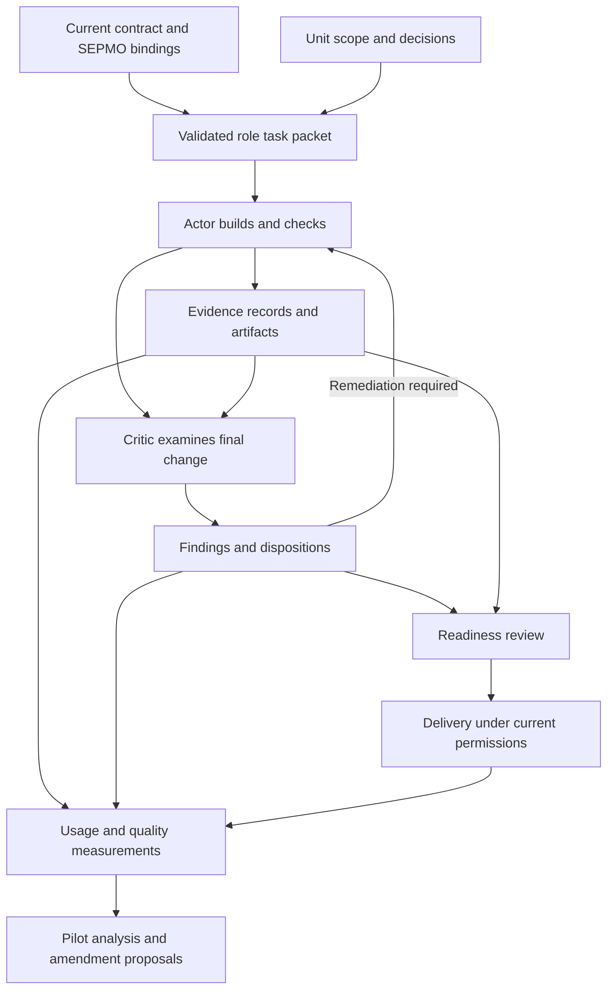

# SEPMO — review and efficiency implementation brief

**Opened:** 2026-09-04. **Class:** campaign. **State:** proposal; implementation scope audit pending.

**Purpose:** preserve the SEPMO review and a practical path to lower token use and elapsed time
per correctly completed unit. This document supports a later intake and implementation charter.

**Retires:** promote this brief to the mid-term roadmap when an intake evaluates it. Freeze and
archive it when every recommendation has an accepted successor or a recorded decision to decline
it, and the pilot has a recorded outcome. Link those successors from the archived record. Follow
the document lifecycle in [AGENTS.md](../../../AGENTS.md#markdown-document-lifecycle).

The owner requested the review and this document. The recommendations below are proposals. They
do not change current gates, agent permissions, canon, or the binding manifest. The authority
chain remains in [AGENTS.md](../../../AGENTS.md#precedence). Implementation must follow the rules
in force until an amendment changes them.

Quick navigation: [pickup](#1-read-this-at-pickup), [assessment](#2-assessment-and-objective),
[baseline](#3-measured-baseline-and-limits), [findings](#4-review-findings),
[agent profiles](#8-operating-profile-per-role), [runtime efficiency](#9-token-and-latency-controls),
[verification](#10-verification-policy-proposal), [metrics](#11-measurement-contract),
[pilot](#12-controlled-pilot), [delivery sequence](#13-recommended-delivery-sequence),
[decisions](#14-decisions-to-resolve-during-intake).

## 1. Read this at pickup

1. Follow the current contributor read path and inspect the checkout and uncommitted work.
2. Read the [SEPMO runbook](../../../.agents/skills/sepmo/unit-runbook.md) and
   [binding manifest](../../../.agents/skills/sepmo/binding-manifest.md). Follow their required
   references. Verify the canon version and the location of its master repository.
3. Reconcile this dated review against changes made since the source revision in §3.
4. Inventory actual worker interfaces and available usage telemetry. Distinguish controls in
   API-backed workers from controls exposed by the desktop application.
5. Select the first bounded unit from §13. Resolve its prerequisite decisions from §14.
6. Create its scope audit, acceptance evidence, implementation paths, and validation plan through
   the current SEPMO process. This brief is not a passed scope audit.

**Recommended first implementation:** usage instrumentation and a compact worker packet pilot.
Measure their effect before proposing narrower verification gates or lighter review obligations.

This brief is an intake reference, not a new mandatory document for every Actor or Critic.
Individual workers should receive the applicable decisions through their approved task packets.
The earlier [Rust unification brief](rust-unification-implementation-brief-2026-09-04.md) records
the product direction; this brief addresses the process used to deliver that work.

## 2. Assessment and objective

Keep SEPMO's evidence and review discipline. Make its execution smaller, clearer, and measurable.

SEPMO helps prevent a convincing but incomplete delivery. It connects requirements to evidence,
keeps unresolved findings visible, requires adversarial review, and separates review convergence
from delivery. Those controls matter for RePark's numeric semantics, Arrow boundaries, and
Iceberg transaction behavior. A successful command can still produce a wrong result.

The process describes correctness controls more thoroughly than their operating cost. Large
instruction loads, repeated records, repeated checks, and serial handoffs can consume resources
without adding independent evidence. These are hypotheses to measure, not quantified savings.

Optimize **total cost and elapsed time per correctly completed, accepted unit**. Include the
Orchestrator, every worker, review, remediation, failed attempts, and abandoned attempts in the
accounting. Keep quality outcomes beside the efficiency numbers.

### Controls to preserve

| Control | Why it earns its cost | Current home |
|---|---|---|
| Checkable scope and finite partitions for broad claims | Prevents a few examples from standing in for a whole compatibility claim | [Scope Auditor](../../../.agents/skills/sepmo/references/01-scope-auditor.md) |
| Tests and evidence tied to requirements | Makes a completion claim independently inspectable | [Testing contract](../../../docs/testing.md) |
| Adversarial review with explicit coverage | Exposes failure modes the builder did not anticipate | [Critic](../../../.agents/skills/sepmo/references/05-critic.md) |
| Recorded findings, dispositions, and unresolved risks | Prevents uncertainty from disappearing during handoffs | [SEPMO](../../../.agents/skills/sepmo/SKILL.md) |
| Honest delivery verification | Distinguishes a converged review from an accepted result | [Delivery](../../../.agents/skills/sepmo/references/07-delivery.md) |
| Existing authority and permission boundaries | Keeps a process optimization within the owner's authorized scope | [AGENTS.md](../../../AGENTS.md) |

Treat attestations as auditable coverage records. They do not prove the absence of every possible
defect. Preserve meaningful behavioral tests and independent counterexamples when simplifying
the records around them.

## 3. Measured baseline and limits

The repository sources were inspected on **2026-09-04**, at checkout HEAD
`671a714421c7294ca0296ef7c8c866d143744526`. The binding declared SEPMO **v2.3**. These are dated
observations; verify them at pickup.

**Publication update, 2026-09-04:** the PR base is
`897151dde186f531ba81f503f5a5ddf5eb728b8f`. The SEPMO source set measured below is unchanged
between those revisions. The counts remain an inspection record, not measured agent usage.

The following counts came from `wc -l -w` over the named files. They measure words in files,
not model tokens, cache hits, compulsory context per role, or billed usage.

| Measured source set | Words |
|---|---:|
| Main SEPMO skill | 6,204 |
| RePark binding manifest | 2,224 |
| Eight numbered reference documents | 16,695 |
| Reference directory map | 538 |
| Unit runbook | 348 |
| **Total for this set** | **26,009** |

This set excludes other skills, repository onboarding documents, code, tool output, conversation
history, templates, and other navigation files. The total is not an assertion that every agent
must read every file. The compact runbook already provides a useful entry point.

The [retrospective contract](../../../.agents/skills/sepmo/references/08-retrospective.md) fixes
eight process metrics. As inspected on 2026-09-04, that set covers review and delivery outcomes
but has no per-role token, cache, model latency, or tool timing fields. Historical process
measurements live in [task/metrics.md](../../metrics.md); this proposal does not rewrite them.

The preceding two-file Rust-unification documentation task ran `make verify` under the current
repository contract. That included Rust checks and tests. It illustrates a possible mismatch
between change impact and validation cost. It is one observation, not a controlled benchmark.

No agent benchmark, model comparison, or measured percentage saving was produced by this review.
Document size establishes a potential input burden. It does not establish the dominant latency
or cost of a real execution.

## 4. Review findings

### F-1. Instruction access should follow the role and the task

The spine, references, binding, engineering documents, and task history can produce a large
startup load. The [unit runbook](../../../.agents/skills/sepmo/unit-runbook.md) already aims to
start a unit without reading the entire spine.

Use that entry point to assemble a small packet with applicable requirements and exact source
references. Retain access to the full material. Record which obligations the packet includes,
and require a refresh when the authority or task changes. Test for omitted constraints before
replacing any mandatory reading.

### F-2. Evidence is repeated across several records

Actor output, self-review, clause tables, readiness checks, and PR descriptions can repeat
commands, results, and explanations. These records serve different readers, but many facts are
the same. The [Actor reference](../../../.agents/skills/sepmo/references/04-actor.md) and
[Orchestrator reference](../../../.agents/skills/sepmo/references/02-orchestrator.md) show the
current artifact responsibilities.

Keep one authoritative evidence record per run or decision. Produce reader-specific views from
that record. Automate factual collection; reserve agent prose for rationale, interpretation,
unresolved concerns, and the relationship between evidence and a claim.

### F-3. Per-action review has a high fixed documentation cost

The [Self Logic Review](../../../.agents/skills/sepmo/references/03-self-logic-review.md) requires
a fixed record before every state-changing action. Every field is mandatory. The same schema
also serves the whole-plan review, despite the different scope.

Propose a full review at meaningful risk boundaries: sensitive changes, external actions, new
assumptions, changes of scope, and failure recovery that needs a new decision. Routine edits
inside an already reviewed plan should have a concise decision-and-evidence record. A changed
precondition must reopen review. A compact record must still identify its scope and evidence.

This is a canon amendment proposal. Current required records remain mandatory. The pilot should
test whether the shorter form loses relevant preconditions or hides unresolved risks.

### F-4. Scope validation and implementation verification need distinct meanings

The [scope audit](../../../.agents/skills/sepmo/references/01-scope-auditor.md) uses `PROVEN` before
execution. Delivery also requires evidence that implemented behavior satisfies the clauses.
The terminology can blur two different achievements.

Propose separate representations for a requirement that is precise and feasible to verify, and
an implementation whose behavior has passed that verification. Example labels are
`SCOPE_VALIDATED` and `IMPLEMENTATION_VERIFIED`; these are candidates, not adopted ledger states.

Keep blocking scope decisions visible. A bounded discovery unit may answer an empirical
question before implementation scope is frozen. It must name the experiment, evidence, and
decision it will support. This is not permission to proceed through an unresolved product choice.

A state change must migrate the grammar, pinning rules, templates, and bindings together. A
wording-only replacement would leave the process inconsistent.

### F-5. Review independence should be expressed honestly

The [Actor reference](../../../.agents/skills/sepmo/references/04-actor.md) asks that the Actor
not be told about the Critic. It also acknowledges that a single session cannot forget context.
Reframing findings to preserve that fiction adds coordination work with uncertain benefit.

Keep the Actor responsible for complete work regardless of later review. Give the Critic the
requirements, final change, relevant dependencies, and evidence access. Preserve the existing
exclusion of the Actor's self-review narrative from the initial Critic packet.

Use the current procedural role transition when one session does the work. Where authorized
and justified by risk, use a fresh reviewer context. The improvement target is independent
behavioral evidence. Fresh context alone does not guarantee an independent or correct result.

### F-6. Existing proportionality should carry more of the workload

The [binding manifest](../../../.agents/skills/sepmo/binding-manifest.md) already defines LIGHT,
STANDARD, and HIGH profiles. It retains the full bound obligations and distinguishes LIGHT from
the bound CCC engine. Cycle limits and readiness reuse also already exist in SEPMO.

Improve those mechanisms before adding stages. Make duplicated reads, repeated gate runs, and
repeated failure cycles visible. Define which evidence remains valid after a change. Keep
required attack coverage, fresh behavioral checks, and final verification until a reviewed
amendment changes them. Findings must be judged by validity and impact, without a quota.

### F-7. Logical roles should not imply a new physical agent every time

Readiness bookkeeping, metric aggregation, and evidence formatting can often be programs.
Model calls are valuable where interpretation or judgment is needed. A role remains a useful
responsibility even when a tool performs most of its work.

Define capability and risk requirements centrally. Keep provider-specific model mappings in
tool adapters. The inspected binding includes tool-specific tier references; verify those
against the tools actually in use before routing work. Preserve the current single-agent
default and delegation permission policy.

### F-8. Efficiency needs a measured feedback loop

The current retrospective metrics help assess failures and review quality. Add token, cache,
latency, resource, and retry measurements. Evaluate the total path to acceptance. A fast initial
Actor response can be expensive if it causes multiple remediation cycles.

Review the cost and unique value of controls at the applicable process boundary. Preserve the
history and rationale of a retired control. Follow SEPMO's canon-amendment and feed-forward
rules; a runtime agent must not lower the bar to meet its budget.

## 5. Proposed execution design

Keep authoritative policy, task state, evidence, and generated views distinct. The diagram
describes information flow. It does not request extra agents or change the current lifecycle.

Reuse existing ledgers and their artifact links as the initial evidence index. Avoid creating a
parallel status system. The first implementation should be a small adapter around existing work,
with a second abstraction added only when a real consumer requires it.

## 6. Compact worker packet

This is a proposed information contract, not a new mandatory serialization format.

| Field group | Contents |
|---|---|
| Identity | Unit, role, attempt, packet format version, task reference |
| Source identity | Repository, base revision, working-diff identity, relevant untracked inputs |
| Authority | Applicable contract and binding versions; required source references and constraints |
| Scope | Objective, requirement identifiers, acceptance criteria, explicit exclusions |
| Implementation context | Relevant files, callers, interfaces, dependency decisions, known traps |
| Verification | Required commands, behavioral cases, oracle requirements, evidence destinations |
| Permissions and resources | Authorized actions, ownership boundaries, resource limits, escalation conditions |
| Handoff | Expected output fields, unresolved decisions, dependency consumers |

Packet assembly must preserve safety boundaries, requirement identifiers, and applicable
obligations. A source hash detects change; it does not prove that a summary preserved meaning.
Use representative constraint-omission tests and human review to validate the assembly rules.

Put stable instructions before task-specific material where the interface supports that layout.
Do not place changing timestamps, run identifiers, or status prose ahead of a reusable prefix.
Keep referenced source available, and have the worker fetch relevant definitions or callers when
the excerpt is insufficient. A small packet must not become a reason to guess an interface.

At a handoff or compaction boundary, preserve the current objective, constraints, changed files,
decisions and evidence, failed hypotheses, required checks, and unresolved work. Avoid replaying
the entire conversational history. Revalidate mutable facts after resumption.

## 7. Evidence collection and agent output

### One evidence record, several views

Capture command identity, actual exit status, start and finish times, source identity, relevant
tool versions, artifact paths, and artifact integrity information mechanically. Link behavioral
evidence to the requirement it supports. A valid record needs enough information to reproduce
or inspect its result.

Keep the existing ledger as the human-readable index while evaluating the collector. Choose a
machine-readable carrier during intake. Generated summaries must cite the original record and
must not silently change a finding, an approval, or a result. A parser must report malformed or
missing data explicitly.

Mechanical validation can check required fields, references, fingerprints, and command outcomes.
It cannot establish that a test adequately covers a claim. That remains a review responsibility.

### Compact hand-back content

An Actor hand-back should carry the outcome, changed files, requirement-to-evidence links,
verification results, remaining concerns, and resource cleanup. A Critic hand-back should carry
findings, required coverage and evidence, dispositions, and the evidence behind convergence.

Preserve full raw logs when the evidence contract requires them. Give the receiving agent a
short summary and the relevant excerpts, with access to the complete artifact. Record truncation
explicitly. Do not replace verbatim oracle evidence with a model-written paraphrase.

These proposed views must continue to satisfy the existing record formats until their homes
are amended. Do not add a second manually maintained copy as an intermediate optimization.

## 8. Operating profile per role

| Role | Initial context | Best use of reasoning | Compact output |
|---|---|---|---|
| Scope Auditor | Requested behavior, existing contracts, affected interfaces, known unknowns | Partition claims; expose contradictions and missing decisions | Checkable scope, unresolved questions, evidence plan |
| Orchestrator | Architecture, scope, dependency map, decisions, compact unit status | Resolve boundaries, sequence dependencies, assemble results | Unit packets and binding decisions with evidence references |
| Actor | Its packet, relevant code and callers, acceptance tests | Implement the bounded change and investigate failures | Final change summary, verification evidence, unresolved concerns |
| Critic | Requirements, final change, relevant consumers, test and artifact access | Find counterexamples and uncovered failure paths | Findings, dispositions, coverage, independent evidence |
| Readiness reviewer | Final source identity, evidence index, findings, dispositions | Decide whether evidence supports the delivery claim | Readiness result and exact remaining blockers |
| Retrospective | Aggregated measurements and significant incidents | Identify recurring causes and valuable process changes | Measured outcomes and amendment proposals |

### Model selection

Use measured task performance to choose a model and reasoning effort. Architecture, concurrency,
transaction correctness, and difficult semantic failures are candidates for stronger reasoning.
Precisely specified mechanical tasks are candidates for faster models or ordinary programs.

Evaluate actor, review, and rework cost together. Keep a failed attempt in the accounting when
a stronger model takes over. Preserve explicit user choices and the active adapter's permission
rules. This proposal does not select specific model names or authorize delegation.

### Budget behavior

Set initial soft budgets from observed task classes once telemetry exists. Include context,
output, elapsed time, tool work, and remediation attempts. A budget warning should trigger a
compact checkpoint and a decision about the approach. It must never trigger a false completion
claim, an omitted check, or an unauthorized action.

Use the existing cycle policy when failures repeat. Record the recurring failure, attempted
hypotheses, evidence, and the decision needed to change course. Avoid another attempt with the
same inputs and no new reason to expect progress.

## 9. Token and latency controls

### Bounded tool output and selective reads

Search for relevant symbols and paths first. Read the owning implementation and the required
callers or contracts. Batch independent reads, but cap their combined output. Multiple large
responses can still overflow a single result. Record omitted ranges and request them only when
they become relevant. Avoid repeated full-file reads while the source is unchanged.

Keep full test logs on disk when needed. Return exit status and a concise summary on success;
return the relevant diagnostic context on failure. Keep enough surrounding detail to preserve
causality. Search the full log if the excerpt does not explain the failure.

### Output and round trips

Shorten repeated status prose, serialized handoffs, and reformatted evidence. Preserve decisions
that the next role needs. OpenAI identifies output generation, request count, and parallel work
as separate latency levers in its
[latency guidance](https://developers.openai.com/api/docs/guides/latency-optimization).
Measure which lever matters for this repository's actual work.

### Prompt caching and compaction

Where API-backed workers expose the controls, maintain stable instruction and tool prefixes and
place dynamic task content afterward. Measure reported cached input. Prefix changes can affect
reuse; consult the current
[prompt-caching documentation](https://developers.openai.com/api/docs/guides/prompt-caching).

Caching reduces repeated input processing. It does not remove the context from the task or
eliminate output, review, or build time. Some desktop interfaces do not expose the same settings.
Do not promise a cache configuration the active interface cannot control.

Compact at useful boundaries when old context is no longer useful. Preserve a validated task
checkpoint. Repeated compaction can lose detail and change the prefix available for caching.
Measure that tradeoff instead of assuming compaction is beneficial on every turn.

### Parallelism and machine resources

Parallelize independent investigation only where the active policy permits it. Keep dependent
operations and mutations ordered. Reviewers must evaluate a pinned final candidate; concurrent
Actor edits must not change the source beneath their evidence.

Budget CPU, memory, disk, build concurrency, and shared cache locks. Several workers compiling
the same Rust workspace can compete for resources. A shared dependency cache can save disk while
still causing contention. Keep private mutable test state where isolation requires it.

Record total resource use and the elapsed critical path separately. Overlapping worker times
must not be added together and reported as user wait time. Follow the repository's existing
disk and artifact ownership rules throughout.

## 10. Verification policy proposal

Current required commands remain authoritative in [AGENTS.md](../../../AGENTS.md), the
[Makefile](../../../Makefile), and the
[binding manifest](../../../.agents/skills/sepmo/binding-manifest.md). As inspected on 2026-09-04,
LIGHT classification does not exempt a unit from its bound green commands.

Two possible improvements need separate evaluation:

1. A documentation-specific gate for changes proven to affect only eligible prose or navigation.
2. Reuse of verification evidence when every input relevant to that result is unchanged.

A classifier must inspect semantic effect. A policy change written in Markdown can alter
permissions or testing obligations. A recorded fixture, an executable example, and a passive
paragraph do not have the same verification requirements. File extensions alone are insufficient.

For evidence reuse, define at least these inputs:

| Input | Required treatment |
|---|---|
| Source and fixtures | Identify the actual tested tree, including relevant dirty and untracked inputs |
| Dependencies and tools | Include locks, toolchain, enabled features, flags, and verification script versions |
| Execution conditions | Include platform and relevant environment configuration without recording credentials |
| Command | Preserve the exact check and scope; a partial command cannot stand in for the required suite |
| Result artifact | Require a complete, valid result and an available artifact; missing evidence invalidates reuse |
| External state | Apply explicit freshness rules; source identity alone cannot validate live services or mutable oracles |

Start with shadow classification: record which checks a proposed policy would select while
running the current required gates. Compare predicted selection with actual defects and failures.
Retain the full required final integration gate during the pilot.

Any later change must update the governing contract, bindings, relevant scripts, and CI together.
Use the current approval and review process for those changes. A cached green result from an old
candidate must not establish readiness for a changed candidate.

## 11. Measurement contract

Add the following measurements alongside the existing eight metrics. Select their durable home
and schema during intake. Avoid making agents transcribe tool-reported usage.

| Group | Proposed fields and interpretation |
|---|---|
| Identity | Unit, role, attempt, risk profile, model, reasoning effort, prompt and packet versions |
| Input usage | Provider-reported input, cached input, cache writes where exposed, and field semantics |
| Output usage | Output and any reported reasoning-token breakdown; avoid counting a subset twice |
| Tool volume | Returned bytes or reported tokens, truncated results, repeated reads, generated artifact size |
| Time | Request spans, tool spans, build and test time, waits, queueing, approvals, overall elapsed time |
| Rework | Attempts, remediation cycles, repeated commands, model escalations, abandoned runs |
| Resources | Peak memory where measurable, CPU use, disk growth, cleanup, cache and build contention |
| Quality | Hidden-case correctness, valid findings, false positives, seeded defect detection, later escapes by severity |

Keep missing telemetry as unavailable. Do not convert it to zero or estimate billed tokens from
word counts. Record raw provider field meanings before normalizing them. Cached input may be a
subset of total input, and reasoning tokens may be a subset of output.

Compute monetary cost only when the applicable dated rates and complete usage are available.
Account allowances, provider billing, and model token counts are different measurements. Report
each in its own terms.

Useful rollups include total cost through acceptance, elapsed time through acceptance, acceptance
rate, remediation cost, median latency, and tail latency when sample size supports it. Include
failed and abandoned work in aggregate cost. Report quality next to each efficiency comparison.

Avoid optimizing findings count. It can reward noise. Use validated findings and seeded-defect
detection with an explicit denominator. Observed escaped defects also need an observation window;
a recent release has had less time to reveal failures.

## 12. Controlled pilot

Use a frozen task set with representative risk and complexity. Establish expected behavior and
hidden evaluation cases independently of the candidate prompts. The evaluation method should
follow a repeatable task definition, execution, and analysis loop; see OpenAI's
[evaluation guidance](https://developers.openai.com/api/docs/guides/evals).

### Task strata

| Stratum | Question it answers |
|---|---|
| Passive prose and navigation | How much overhead remains when behavior does not change? |
| Mechanical edits with precise acceptance criteria | Can a smaller packet or faster model complete bounded work reliably? |
| Python facade work with Rust ownership constraints | Does reduced context preserve the implementation boundary and entry-point contract? |
| Rust semantic changes | Does the workflow preserve values, types, errors, and regression coverage? |
| Sensitive write or recovery behavior | Does review still catch ordering, retry, concurrency, and data-integrity defects? |
| Broken environment or ambiguous evidence | Does the workflow diagnose uncertainty without claiming success or consuming repeated futile cycles? |

### Experiment sequence

1. Record the current workflow, policy versions, model settings, and tooling as the baseline.
2. Add telemetry without changing obligations. Verify reconciliation and missing-data handling.
3. Compare compact packets and generated evidence views against the baseline with the same
   model settings and required gates.
4. Separately compare eligible model and reasoning-effort choices. Keep review obligations fixed.
5. Run verification selection and revised review records in shadow or an explicitly authorized
   isolated experiment until their governing amendments are accepted.

Use the same starting source and task definitions within each comparison. Include several trials
and randomize order where practical. Separate cold-cache and warm-cache results, record machine
contention, and prevent simultaneous builds from contaminating a comparison. Keep hidden
evaluation cases out of agent context and do not publish their expected answers in task packets.

### Acceptance and stopping rules

Choose numerical efficiency targets and acceptable statistical uncertainty before examining
candidate results. A small pilot can establish feasibility and reveal defects; it cannot prove
that rare escapes are unchanged across all future work.

Require complete mandatory evidence, preserved permissions, and successful evaluation on the
held-out cases. A faster result with an omitted constraint or unsupported readiness claim fails
the pilot. Investigate any missed sensitive-path defect before promotion. Re-run an invalid trial
only with its reason recorded and its consumed resources retained in the accounting.

Report outcomes by task stratum and across the full sample. Do not let many cheap documentation
tasks conceal worse correctness or cost on write-path work. Preserve the baseline and a rollback
path to the prior prompts, packet format, and routing rules.

## 13. Recommended delivery sequence

Each row is a candidate work package. It needs a scoped charter before implementation. Paths are
candidate change locations; verify them and their maps at pickup. No code is created by this brief.

| Order | Work package | Deliverable and acceptance evidence | Likely home and dependency |
|---|---|---|---|
| E-0 | Capability and telemetry inventory | Exact worker interfaces, available fields, unavailable controls, frozen baseline and pilot task set | Existing adapters and an indexed experiment artifact; first |
| E-1 | Usage and execution collector | Validated event records; correct units and missing-data behavior; reconciled sample runs | Small tooling extension under `scripts/` or the actual worker wrapper; after E-0 |
| E-2 | Compact role packets | Versioned packets, source refresh behavior, constraint-preservation tests, baseline comparison | Existing runbook, applicable adapters, packet tooling; after E-0 and E-1 |
| E-3 | Evidence collection and generated views | One source per fact; ledger and hand-back views trace to immutable run evidence; malformed data fails clearly | Existing ledger machinery and tooling; after E-1 |
| E-4 | Prompt and model routing pilot | Per-stratum quality, tokens, cost when available, elapsed time, and retry results | Tool-specific adapters; after E-2 and E-3 |
| E-5 | Canon clarification proposals | Separate scope and implementation meanings; proportionate review records; honest role-transition wording; migration tests | Canon master repository, then propagated bindings; after pilot evidence and required approval |
| E-6 | Verification policy experiment | Shadow classifier results and explicit evidence invalidation tests; full existing gate retained during experiment | AGENTS, binding, Makefile, scripts, CI as applicable; after E-1 and explicit scope approval |
| E-7 | Adoption and retrospective | Measured decision for every recommendation, versioned changes, rollback instructions, durable outcome record | Existing metrics and lifecycle homes; after accepted pilot outcomes |

E-5 and E-6 can be declined without blocking useful packet or telemetry improvements. Do not
bundle a neutral measurement change with a reduction in mandatory checks.

SEPMO's [canon convention](../../../.agents/skills/sepmo/SKILL.md) requires portable changes to
be amended at the master home and propagated with a version update. A RePark-local copy must
not silently diverge. The binding holds project-specific settings. Follow the current timing
and approval rules for changes that lower or otherwise alter the process bar.

## 14. Decisions to resolve during intake

| Decision | Recommended starting position |
|---|---|
| Which worker interfaces are in scope? | Start with interfaces actually used for RePark; record the controls each exposes |
| Where does telemetry live? | Extend existing evidence tooling; keep the ledger as its human-readable index |
| What may a packet omit? | Nothing mandatory until packet assembly and any required contract amendment are validated |
| Which roles need fresh contexts? | Use risk and measured review value; preserve current delegation permissions |
| Which models should be compared? | Select candidates by capability and availability during intake; keep names in adapters |
| How are token and time budgets chosen? | Derive soft budgets from observed task strata and include rework |
| What defines pilot success? | Predeclare quality requirements and efficiency thresholds; report uncertainty and sample size |
| Where is the canonical SEPMO master? | Resolve its exact repository and version before proposing portable edits |
| Can verification evidence be reused? | Shadow the policy first; require explicit invalidation and final-gate rules |
| Which process records can be shortened? | Compare their unique decision value and defect detection before an amendment |
| Who owns the final adoption decision? | Use the current owner and canon approval boundaries; the pilot provides evidence |

## 15. Source index

Repository sources were inspected on 2026-09-04. Read their current contents at implementation
time. This brief preserves dated observations and recommendations; it is not their replacement.

- [Contributor contract](../../../AGENTS.md): authority, permissions, verification, and document lifecycle.
- [SEPMO skill](../../../.agents/skills/sepmo/SKILL.md): lifecycle, invariants, proportionality, and canon amendments.
- [Binding manifest](../../../.agents/skills/sepmo/binding-manifest.md): RePark-specific obligations and tunables.
- [Unit runbook](../../../.agents/skills/sepmo/unit-runbook.md): compact operational entry point.
- [Scope Auditor](../../../.agents/skills/sepmo/references/01-scope-auditor.md): propositions and proof obligations.
- [Orchestrator](../../../.agents/skills/sepmo/references/02-orchestrator.md): context, units, readiness, and record consumers.
- [Self Logic Review](../../../.agents/skills/sepmo/references/03-self-logic-review.md): fixed pre-action review schema.
- [Actor](../../../.agents/skills/sepmo/references/04-actor.md): build, evidence, and remediation obligations.
- [Critic](../../../.agents/skills/sepmo/references/05-critic.md): coverage and finding evidence.
- [Delivery](../../../.agents/skills/sepmo/references/07-delivery.md): acceptance and disposition verification.
- [Retrospective](../../../.agents/skills/sepmo/references/08-retrospective.md): metrics and process tuning.
- [CCC](../../../.agents/skills/critic-critic-critic/SKILL.md): the bound review engine's attack lenses.
- [Testing contract](../../../docs/testing.md) and [Makefile](../../../Makefile): executable verification obligations.
- [Process metrics](../../metrics.md): historical measurements, preserved in their existing home.

External primary sources consulted for the 2026-09-04 review are linked beside the recommendations
they support: latency and prompt caching in §9, and evaluation design in §12. Recheck those sources
before choosing API-specific controls. No provider-specific pricing or performance guarantee is
assumed by this proposal.
