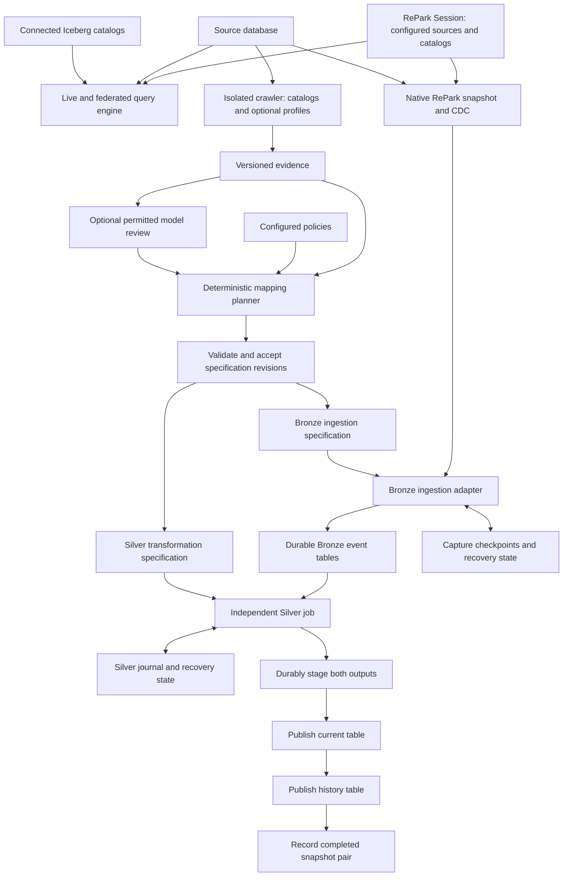

# RePark: Unified Database Query, Discovery, CDC, and Silver Plan

> Owner's proposal, filed verbatim on 2026-09-13 (its own date 2026-09-09, revised 2026-09-13). It consolidates
> the earlier [database discovery proposal](database-discovery-lakehouse-planning-2026-09-09.md) in place;
> that file stays as the record of the first cut. The roadmap placement it drove is the 2026-09-13 row of the
> [release roadmap](release-roadmap-2026-08-29.md) Q&A log: Postgres and SQL Server connectors at 1.6, the
> medallion release at 1.7. Four absolute links were made relative and two links to a ledger not yet on main
> became plain mentions; nothing else changed.

Date: 2026-09-09  
Revised: 2026-09-13 — native query/CDC direction and consolidated Silver planning recommendations.  
Status: Selected architecture direction with open implementation decisions; operational guarantees remain to be verified.  
Lifecycle: This standalone proposal closes when an accepted repository design supersedes it. Preserve it as the proposal record.

## 1. Purpose and selected direction

RePark presents one Session that connects configured operational databases and Iceberg catalogs. The selected product direction includes live database queries, queries combining supported databases and Iceberg tables, and native Rust capture. Customers do not need to operate an external CDC producer for the native path. These are planned capabilities, not a claim of current implementation.

Alongside the query engine, three independently managed operations use versioned contracts:

1. **Crawler and planner:** inspect source catalogs and DDL, optionally profile selected data, and propose Bronze and Silver mappings. The run terminates after producing its artifacts.
2. **Native snapshot and CDC ingestion:** RePark captures initial data and subsequent changes, validates the ingestion contract, and durably publishes Bronze events.
3. **Silver processor:** consume retained Bronze events under an accepted transformation specification and publish current and optional historical tables.

Owner decision, 2026-09-13: the crawler is separate from CDC and Silver execution. An accepted mapping remains usable when no crawler process is running. Discovery can run manually, on a schedule, or after a schema-change signal. A crawler run does not start capture, create destination tables, or launch a Silver job as a side effect.

Adaptation means proposing and accepting a new mapping revision at a defined boundary. Executing jobs retain their exact accepted revision. The model reviewer is optional and has no authority to execute transformations or change a running job.

This document is the unified planning home. It consolidates the earlier crawler and publication proposal in place. The repository audit remains supporting evidence, not a second architecture plan. Section 16 tracks remaining implementation choices. Section 17 records the recommended Silver baseline requested by the owner. These recommendations guide further design; they do not establish implemented capabilities or runtime readiness.

| Selected direction | Detailed contract |
|---|---|
| One Session for configured database and Iceberg queries; native Rust CDC owned by RePark | Sections 2–4 |
| Independent crawler, capture, and Silver lifecycles | Sections 3–4 |
| Immutable accepted specifications between components | Sections 7 and 10 |
| Per-dataset current-only or historical Silver | Section 11 |
| Two physical consumer tables for historical mode | Section 11 |
| Durable staging, current publication, history publication, then completion | Section 11 |
| Explicit history lag and completed snapshot pairs for consistent reports | Section 11 |
| Latest invalid successor withdraws previous current; previous accepted version becomes closed history | Sections 11 and 17 |

Source schemas, table names, naming policies, retention, and business rules remain configuration. PostgreSQL is the proposed first discovery source; SQL Server is a later candidate. Native capture is the selected product direction. External CDC compatibility is an optional future integration, not the required customer setup. The first native source/version and delivery boundaries remain open. This plan does not reproduce source triggers, indexes, stored procedures, sequences, or application transaction behavior in Iceberg.

## 2. Relationship to RePark

The platform sits above RePark's query and table APIs. RePark remains the execution engine; its owned Iceberg fork remains the table-format engine. Discovery and planning do not require distributed query execution.

The current repository separates engine code, SQL entry points, Python bindings, and Iceberg integration. The proposal preserves those boundaries. Python may manage metadata and construct plans. Source-row decoding and local data transformations belong in Rust; source databases may execute pushed-down profiling queries.

As reviewed on 2026-09-09, the roadmap places database connectors, incremental processing, and connector CDC in future milestones. This proposal describes a consumer of those capabilities, not a claim that they already exist. Repository contracts and delivery state remain authoritative in [AGENTS.md](../../../AGENTS.md), [ARCHITECTURE.md](../../../ARCHITECTURE.md), [STATUS.md](../../../STATUS.md), and the [release roadmap](release-roadmap-2026-08-29.md).

### Session and native connector contract — owner direction, 2026-09-13

Session loads configured database connections and Iceberg catalogs into one named query namespace. Each native database connector provides discovery, live query access, and snapshot/CDC capabilities where supported. Capability support is explicit: a database can be queryable before its CDC mode is qualified.

Share source identity, configuration, authentication, and type mappings across those capabilities. Use appropriate separate query pools, snapshot transactions, and replication connections. An interactive query must not monopolize a replication connection or advance its checkpoint. Bound capture and query resources independently.

A query can read live source tables, Iceberg tables, or combine them through RePark's engine. Push eligible operations to the source only when semantics match the selected SQL door. Define supported types, pushdown rules, transfer limits, cancellation, and source consistency per connector. A live database and an Iceberg snapshot do not automatically share one transactional read boundary. Queries requiring replicated-state consistency should use a declared Bronze/Silver processing boundary instead.

Recommended activation policy: Session registers configured sources and resumes CDC jobs only for sources explicitly enabled for capture under an accepted specification. Query connectivity alone does not imply capture privileges or source setup. A saved configuration can supply the complete enabled pipeline for automatic startup. The exact eager/lazy connection and startup-failure behavior remains open.

The isolated crawler uses those same connectors for metadata and optional profiling. It remains a bounded operation. Its output configures ingestion and Silver; its process does not own their ongoing execution.

Two lifecycle modes are proposed. In embedded mode, Session owns CDC tasks and shutdown leaves recoverable checkpoints; work stops when its host process exits. In service mode, a long-running RePark service owns the engine, connectors, and jobs; an interactive client can disconnect without stopping capture. The implementation should share the Rust engine across both. Initial mode, supervision, installation artifacts, and recovery from host loss remain open.

## 3. System overview and independent lifecycles

The publication branch shows historical mode. Current-only mode omits the history target. Capture state and Silver state have separate ownership and checkpoints; they need not use separate database services. A common scheduler may launch all components, but no running component depends on a live crawler session.

| Component | Trigger and lifetime | Required inputs | Durable outputs |
|---|---|---|---|
| Query engine | Per request within Session | Named database and catalog connections, query, resource limits | Query results; no implicit capture checkpoint effects |
| Crawler/planner | Explicit bounded run; optional schedule or drift-triggered run | Source metadata access, discovery scope, policies; optional profile budget | Evidence, proposed specifications, differences, blockers |
| Native snapshot/CDC ingestion | Session or service owns enabled capture jobs; continuous or bounded catch-up where supported | Accepted Bronze specification, qualified producer, capture privileges where needed, destination access | Bronze events, schema/provenance records, capture checkpoints |
| Silver processor | Scheduled batch, available-input trigger, or explicit replay | Accepted Silver specification, retained Bronze input, destination access | Current/history outputs, internal evidence, completed jobs and checkpoints |

Silver processing needs no operational source connection. Crawler credentials do not flow into the Silver specification. The snapshot/CDC producer may use source-specific shared libraries with discovery, but owns its own lifecycle and capture state.

A failure in discovery leaves previously accepted capture and Silver specifications usable. A Silver failure does not immediately stop capture; retention and resource limits eventually apply backpressure. A capture failure leaves existing Bronze input available for Silver processing.

## 4. Component contracts and replacement boundaries

| Component | Owns | Outputs and boundaries |
|---|---|---|
| Connection registry | Source identities, secret references, validation | Session-scoped connections; no credentials in plans or reports |
| Native database connector | Discovery, live query scans, snapshot and capture APIs; shared source/type identity | Separate query and capture connections, explicit capability matrix, source-specific correctness |
| Profiler | Bounded source measurements and provenance | Optional evidence; omitted measurements remain unknown |
| Evidence store | Immutable discovery/profile runs | Independently readable artifacts after crawler exit |
| Planner and optional model reviewer | Deterministic mappings and advisory recommendations | Proposed specifications; no execution authority |
| Plan validator | Types, identities, capability requirements, acceptance | Immutable accepted revisions with explicit activation boundaries |
| Native capture runtime | Source snapshot handoff, event order, source acknowledgements | Rust-owned source events and capability manifest; durable capture lifecycle |
| Bronze ingestion adapter | Producer normalization, envelope validation, Bronze writes and reconciliation | Replayable typed events; qualified producers only |
| Silver processor | Source-state reconstruction, accepted rules, current/history derivation | Deterministic candidates from bounded Bronze input |
| Silver job coordinator | Admission, staging, publication sequence, recovery | Durable per-pair jobs and completed snapshot pairs |
| RePark engine | Plans, row transformations, sanctioned Iceberg writes | Shared Rust execution through Session and existing APIs |
| Owned Iceberg fork | Table-format actions and commit primitives | Capabilities documented in the fork's own contracts |

The Bronze adapter keeps Silver independent of source-specific capture. Native RePark capture must meet its contract. Optional future external feeds would be accepted only when it supplies the required snapshot, identity, ordering, schema, and partial-value semantics. A transport connection or a familiar event format alone does not establish compatibility. RePark owns native capture correctness through Bronze publication. Any optional external integration must assign upstream responsibility explicitly and qualify the claimed source mode.

Externally written Bronze tables are a further integration mode, not automatically supported by external CDC ingestion. They would need the same event contract, durable progress evidence, and write-ownership rules. Exact producer formats and transport protocols remain open. No particular broker, connector service, or additional installed binary is mandated by this design.

Infrastructure provisioning and target creation are separate explicit execution operations. The crawler may report prerequisites and proposed table schemas. It does not create roles, change source capture settings, or publish destination data during inspection.

## 5. Discovery and source identity

Extract structured metadata directly from source catalogs. Render reconstructed DDL as a human-readable attachment, not as the planner's primary input.

For each supported source object, capture:

- Source instance and database identity, schema, table, and source object identifiers where available.
- Column identity, order, declared type, precision, scale, nullability, collation, and time-zone semantics.
- Primary and unique keys, including ordered composite columns and constraint validity where available.
- Foreign keys, generated columns, defaults, and relevant partition relationships.
- Capture readiness, replica identity or equivalent, required permissions, and unsupported types.
- Visibility limitations: objects unavailable through permissions must not be treated as absent.

Persist a canonical schema fingerprint and a discovery timestamp. Source object identifiers are scoped to a database and its lifecycle; a restored or recreated object must not silently inherit an old mapping.

Catalog discovery does not automatically provide a transactionally consistent view across multiple queries. The adapter records the consistency method. If it cannot obtain a consistent observation, recheck the schema before accepting a plan and before extraction.

## 6. Bounded profiling

A metadata-only crawl is a supported planning mode. Profiling is optional and requires an explicit scope and budget. Missing profile evidence may leave decisions unresolved; it does not force the crawler to scan source rows.

Profiling proceeds from cheaper evidence to more expensive evidence. Each stage runs only when it can resolve a planning question within the configured budget.

| Tier | Work | Boundaries |
|---|---|---|
| 0 | Catalog estimates and available optimizer statistics | Record freshness, privileges, and missing statistics |
| 1 | Selected null, range, length, and cardinality measurements | Bound query duration and table scope; select metrics by need |
| 2 | Frequency summaries for selected columns | Limit eligible columns and returned values; apply disclosure policy |
| 3 | Histograms or targeted validation queries | Run only for unresolved decisions that justify the cost |

A single aggregate statement can still perform expensive sorting, hashing, and temporary disk work. Query count is not a source-load guarantee. Missing row estimates must not silently select a full-table scan.

Configuration includes table allowlists, concurrency, statement and lock timeouts, a run deadline, sample limits, maximum returned evidence size, and per-tier permissions. Enforce hard limits where the source provides mechanisms; label estimated limits honestly elsewhere. Prefer replicas when their freshness and capture behavior meet the intended use.

Each measurement records its source schema version, query or query-template version, observation interval, sample method, sample population, and exact/estimated/sampled classification. Independently sampled tiers must not be presented as one shared population.

The run manifest lists requested, completed, partial, failed, excluded, and unsupported tables. Missing measurements remain unknown. No failed table disappears from the inventory. Persist completed table results incrementally so a large run can resume without repeating all work.

## 7. Versioned artifacts between components

Use validated, serializable records. Rust owns execution contracts; Python metadata interfaces use Pydantic models under repository conventions. Human-readable YAML or JSON renders these records. Exact public schemas and APIs remain to be designed.

| Artifact | Producer → consumer | Required content |
|---|---|---|
| Discovery evidence | Crawler → planner and reviewer | Source identity, visibility, structured schema, declared keys, schema fingerprint, observation time, adapter version |
| Optional profile evidence | Profiler → planner and reviewer | Discovery reference, sampling provenance, exact/estimated classification, budget use, completeness manifest |
| Producer capability manifest | Capture adapter configuration → validator | Source/capture mode, snapshot guarantees, order domain, transaction boundaries, key images, value availability, schema signaling |
| Bronze ingestion specification | Planner and acceptance → ingestion | Source/table identity, payload mapping, envelope version, producer requirements, destination identity, schema mapping, retention requirements |
| Silver transformation specification | Planner and acceptance → Silver processor | Referenced Bronze contracts, key and order rules, target mappings, transformations, quality policy, history mode, history rules, internal evidence requirements |
| Decision and recommendation records | Rules or reviewer → acceptance | Stable IDs, evidence references, rationale, alternatives, validation state; optional model/prompt versions and usage |
| Acceptance and activation | Reviewer or preapproved policy → independent runtimes | Exact artifact hashes, authority, scope, compatibility validation, activation boundary |
| Capture checkpoint | Ingestion → capture recovery | Producer identity/generation, durable Bronze outcome and source boundary |
| Silver job record | Silver coordinator → recovery and reporting | Section 11's job record; independently owned progress |

A discovery-only run may produce specifications that remain blocked for execution until a producer capability manifest is supplied. DDL describes structure; it does not establish a gap-free snapshot handoff, transaction ordering, or full before/after images.

Bronze and Silver specifications are separately versioned. A Silver transformation revision can reuse the same Bronze contract without restarting capture. A changed Bronze contract triggers compatibility checks for its consumers; it cannot silently replace their input interpretation. A plan bundle can group compatible revisions for review without forcing simultaneous deployment.

Acceptance does not activate a job. A runtime start or revision transition validates the accepted artifact against the actual target and input contract. Store hashes and versions with each job so later discovery or model output cannot change a replay.

Separate declared constraints, observations, heuristics, and accepted policies. Heuristic confidence is not permission to execute. Identical evidence, rules, and policies produce identical canonical planning output. Timestamps and run IDs remain provenance outside semantic hashes. Stored model recommendations are inputs to revision planning; inference itself is not deterministic.

## 8. Planning rules

### Keys and ordering

Use declared valid keys and supported replication identity before proposing inferred keys. Preserve composite keys. Snapshot uniqueness establishes an observation about that snapshot; it does not establish future uniqueness or a business identity.

A nearly unique column does not prove version history. A hash of selected attributes does not establish source identity. Tables without a supported identity remain blocked for update/delete replication unless a separately specified strategy preserves duplicates and changes correctly.

Keep three concepts separate: source identity, source change ordering, and business event time. An updated timestamp or ingestion timestamp cannot replace the source's capture position and event ordering. History accumulation is an explicit policy, including tie handling and late changes.

### Types and missing values

Preserve source precision, meaningful time-zone behavior, NULLs, and binary payloads by default. An unsupported mapping blocks the affected table or column according to explicit policy; it does not silently stringify or discard data.

Do not infer required decimal scale from minimum and maximum alone. Validate any permitted narrowing against the relevant data and define future out-of-range behavior. Do not infer an enforced boolean domain from sampled or truncated frequency results.

Missing-value substitution is opt-in. Distinguish NULL, blank text, zero, and configured sentinels. No observed sentinel collision is not proof that future collisions cannot occur. Unknown collision counts remain unknown.

### Names and dependencies

Naming policies are configurable. Validate normalization collisions, reserved names, valid target identifiers, and namespace collisions before plan acceptance. Preserve explicit source-to-target mappings instead of depending on reconstructed names.

Changes to keys, types, or target names trigger validation of dependent decisions. A model recommendation cannot replace a key while leaving an old classification or transformation plan accepted.

## 9. Optional model review

The deterministic planner works without a model. A configured model may explain uncertain relationships, suggest mappings, and turn unresolved decisions into concise review questions. It cannot establish uniqueness, authorize a destructive change, or invent missing source evidence.

Only policy-permitted evidence reaches the reviewer. Catalog statistics, frequent values, minimum values, and maximum values can contain sensitive source data. A column-name classifier is advisory and cannot authorize disclosure. Use explicit allowlists, redaction, and evidence-size limits before serialization.

Treat database comments, names, and sampled text as untrusted content. The reviewer receives no source credentials or executable tools. Its output must pass structural validation and the same semantic checks as a manually proposed decision.

Use a constrained response schema where the selected provider supports it. Validate every response locally. Structural compliance does not prove business correctness. Model provider selection is optional configuration.

Bound model use with per-request input/output limits, a maximum request count, capped retries, and a per-run spend budget. Record actual usage when available. Cache recommendations by permitted evidence hash, policy version, rule version, prompt version, and model version. On exhaustion or failure, preserve the deterministic plan and its unresolved decisions.

## 10. Plan acceptance and execution

Planning states are `DRAFT`, `VALIDATING`, `NEEDS_REVIEW`, `ACCEPTED`, and `SUPERSEDED`. Execution states are separate. A valid plan can still be unexecutable because capture prerequisites or destination permissions are missing.

Each accepted specification is immutable. Acceptance applies to its exact hash and policy scope. Evidence changes create a new revision; they do not silently modify an accepted plan. Ingestion revalidates its source or producer identity, input schema, destination, and permissions. Silver validates its Bronze contract, target identities, and permissions without contacting the operational source.

Preapproved policies can accept narrowly defined compatible changes. Other decisions remain explicit review items. The interface shows the proposed result, supporting evidence, data-loss implications, and operational prerequisites.

Generated Python is not the execution contract. Compile a validated declarative plan into RePark operations through its existing session and SQL interfaces. Shared machinery serves both SQL doors where new SQL capabilities are introduced.

## 11. Bronze, Silver, and CDC recovery

### Bronze

The crawler proposes payload fields and type mappings; the ingestion contract defines the event envelope. Proposed field families are listed below. Names and physical encoding remain open; these are required meanings, not a finalized API.

| Field family | Meaning |
|---|---|
| Event identity | Stable producer-scoped identity for duplicate delivery; independent of ingestion attempt |
| Source identity | Source instance, generation, table identity, and capture mode |
| Change identity and order | Operation, source position, transaction identity, event order, and relevant partition |
| Schema provenance | Envelope version, decoding schema, and Bronze mapping revision |
| Key images | Typed before/after keys where available, including composite keys and key changes |
| Value images | Typed before/after payloads and explicit field-presence information |
| Snapshot provenance | Initial-snapshot phase, boundary, and progress evidence required by the capture mode |
| Ingestion provenance | Ingestion time, producer/adapter version, durable batch identity |

The proposed first CDC Bronze representation is a replayable change log, preceded by a consistent initial snapshot. Define snapshot records and change records explicitly. Preserve source identity, operation kind, capture position, transaction and event ordering, ingestion time, schema version, and available before/after values.

Availability of before images and complete values is source-specific. The adapter must describe absent values distinctly from SQL NULL. Do not claim an event contains a full row when the capture protocol provides only changed fields.

### Silver

Silver applies accepted naming, type, and quality policies using a validated source identity. Each dataset selects current-only or historical output. Inferred joins and continuously maintained aggregates remain separate extensions.

Owner decision, 2026-09-13: historical output uses two physical Iceberg tables: `silver.<table>` for current accepted rows and `silver.hst_<table>` for closed accepted versions. Both must be discoverable and directly queryable through supported catalogs from Trino and Spark, without RePark-specific views, functions, or publication lookups for ordinary table reads. Coordinated snapshot-pair reports follow the separate contract below. Additional engines require a declared compatibility matrix; standard Iceberg storage alone does not prove every engine supports every emitted feature.

The entity key persists across versions. History also carries a stable version identity, interval boundaries, and source provenance. Validation status is separate from version status: closing an accepted version preserves its validity as history. A rejected successor withdraws the previous current result under the no-fallback policy. Quarantine evidence and deletion-order state require explicit storage and recovery contracts. Their placement is unresolved; the two consumer tables do not replace those duties.

Section 17 provides the recommended history contract for tracked fields, committed-change boundaries, partial updates, deletes, late changes, and retention. Source ordering must distinguish changes that share timestamps. Business-effective time is separate from capture time. Snapshot duplicates and replay must not create extra versions. Switching an existing dataset to history requires retained evidence or a declared history start boundary.

### Selected Silver publication contract — 2026-09-13

Historical Silver uses a durable sequential job. Stage both outputs, publish current, publish history, then complete the job. History may lag behind current. This decision replaces the earlier requirement for atomic publication across both tables. It does not relax the requirement to validate each candidate against its expected table base.

This is an accepted architecture direction, not an implemented or proven recovery guarantee. The multi-table audit and decision addendum (`task/ledgers/staging/silver-multi-table-verification-ledger.md`, on the owner\'s working branch, not yet on main) preserve the earlier capability investigation. An atomic multi-table catalog service is no longer a prerequisite for the initial writer.

Each table remains independently discoverable and readable. Ordinary latest-head reads can observe current after publication and history before publication. A completed job records both resulting snapshot IDs. Reports needing a consistent pair must explicitly bind both reads to that pair through qualified engine time-travel interfaces. Reading two latest heads, even in one query, is not the paired consistency contract.

Recommended initial operating rule: one unfinished job per current/history pair, with bounded concurrency across independent pairs. A history failure pauses that pair until recovery completes. This limits recovery complexity and accumulated history lag. It provides no atomicity across different source tables or datasets.

### Durable job and staging

Before any visible write, persist a job intent and stage the exact current changes and displaced history. Staging must be durable across the supported restart boundary. Temporary process memory is insufficient. Both candidates must be validated and their retained files recorded before the current table can advance.

| Durable job field | Purpose |
|---|---|
| Stable job identity and separate attempt identity | Reconcile retries without treating each attempt as new work |
| Source identity, generation, input boundaries, and Bronze references | Identify exactly which retained input the job consumes |
| Accepted plan hash and schema mapping versions | Replay the original deterministic interpretation |
| Target table UUIDs, expected snapshots, and required metadata generation | Detect recreation and concurrent changes; define rollback/ABA handling |
| Staged file references, integrity evidence, and candidate description | Recover the exact prepared output after process loss |
| Ownership generation and transition version | Control competing coordinators and conditional journal updates |
| Per-table commit intent, outcome, and resulting snapshot | Distinguish not submitted, unknown, and confirmed outcomes |
| Completed snapshot pair and Silver checkpoint | Expose a durable completion boundary for progress and reporting |
| Retention obligations and last recovery error | Prevent premature cleanup and support operator recovery |

This is the required record content, not a prescribed storage schema. Journal backend, durability scope, backup, and atomic state-transition mechanisms remain open. A lease in the journal alone does not prove that an obsolete worker cannot commit to a catalog. The publication path must enforce the selected ownership and concurrency contract.

### Publication state machine

```mermaid
flowchart LR
    I[Intent durable] --> P[Preparing both outputs]
    P --> S[Both outputs staged]
    S --> CA[Current commit intent]
    CA --> C[Current confirmed]
    C --> HA[History commit intent]
    HA --> H[History confirmed]
    H --> D[Job complete and checkpoint recorded]
    CA --> CU[Current outcome unknown]
    CU --> CR[Reconcile current]
    CR --> C
    HA --> HU[History outcome unknown]
    HU --> HR[Reconcile history]
    HR --> H
```

The unknown branches show successful reconciliation. A conclusively failed attempt returns to a safe retry or conflict-resolution state. An inconclusive attempt stays blocked with its evidence retained. A commit-intent record alone does not show whether the request reached the catalog.

1. Persist intent and bind input, policy, targets, and expected bases.
2. Reconstruct source changes once. Stage and validate both table candidates. Record their durable references.
3. Persist current commit intent, then publish current against its expected base. Reconcile an unknown result before proceeding.
4. Record the confirmed current snapshot. Publish the staged history against its expected base, using the same commit-intent protocol.
5. Record the confirmed history snapshot. Atomically record job completion and its checkpoint in the journal, or use a proven equivalent recovery protocol.
6. Release the pair for its next job. Retain recovery and reporting evidence until the corresponding retention obligations expire.

A job with no mutation for one target records a validated no-op and that target's snapshot. Completion does not require fabricating an empty snapshot. The no-op path still participates in concurrency validation.

For order 1042 changing from 150 to 175:

| Visible phase | Current table | History table | Job status |
|---|---|---|---|
| Before publication | 150 | No closed version | Preparing or staged |
| Current committed | 175 | No closed version | Current published; history pending |
| History committed and completion recorded | 175 | Closed 150 | Complete |

The closed 150 version must already be durably staged before 175 becomes visible. Do not depend on rereading the old current head after replacing it.

### Failure and recovery rules

| Failure boundary | Required behavior |
|---|---|
| Before both candidates are durable | Resume preparation from retained input; publish neither candidate |
| Current commit definitively rejected | Keep progress unchanged; reconcile the conflict and rebuild candidates if required |
| Current commit outcome unknown | Inspect durable commit evidence; do not resubmit blindly or begin history publication |
| Current confirmed, history not submitted | Resume history from the retained candidate |
| History commit definitively rejected | Preserve published current; resolve the history conflict without replaying current or discarding the recovery job |
| History outcome unknown | Reconcile before any retry; prevent duplicate closed versions |
| Both commits confirmed, completion absent | Reconstruct the completed pair and checkpoint without repeating either write |
| Required evidence missing or expired | Stop automatic recovery; expose an explicit repair or resynchronization procedure |

Before current publication, a changed base can require replanning both candidates. After current publication, recovery must preserve the exact logical history obligation already created. A history conflict may require a new physical candidate against a new base, but cannot silently change which versions the job must close.

Stable version IDs and job IDs support reconciliation; they do not enforce uniqueness by themselves. Iceberg history writes need a tested deduplication protocol. Missing snapshot markers cannot establish failure after evidence has expired. Never delete files that might be referenced by an unconfirmed commit.

Do not rollback the current table to repair a history failure. A rollback can erase later legitimate work. The initial supported mutation policy should give RePark exclusive control of each managed Silver pair, including maintenance scheduling. External engines may read normally. Independent external writes require a separate, tested conflict policy before support is claimed.

### Asynchronous execution and progress

A bounded queue carries references to durable jobs. Acceptance into that queue means scheduled, not published. Bound queued jobs, buffered bytes, staging disk, active pairs, and upload concurrency. Apply backpressure when any limit is reached. Numeric defaults require workload measurements.

Preparation can run current and history staging concurrently. Publication follows the sequence above. Session or its service owner owns task cancellation, drain, and restart. A shutdown during commit leaves a recoverable unknown outcome; detached tasks cannot define the writer lifecycle.

Expose queued, preparing, staged, current-published/history-pending, reconciling, blocked, and complete states. Measure capture-to-Bronze lag, Bronze-to-current lag, history completion lag, and the age of the oldest unresolved job separately. A pending history job has no guaranteed completion time while storage or catalog service remains unavailable.

Bronze capture progress and Silver completion are separate checkpoints. Source acknowledgement may follow durable Bronze capture under the source contract; it need not wait for Silver. Bronze retention must protect every unfinished Silver consumer and recovery job. If lag threatens source or Bronze retention, throttle or pause with an explicit recovery status.

RePark owns scheduling, policy, and pipeline recovery. Table-format actions and catalog commit primitives belong in the owned Iceberg fork. The sequential choice removes the atomic multi-table dependency; it does not establish that the current fork already supports strict expected-base commits or the required recovery protocol.

### Capture and recovery protocol

1. Validate source capture prerequisites and destination capabilities.
2. Establish a source-specific snapshot-to-stream boundary with no gap.
3. Persist batch intent before sink effects. Identity includes the source generation, stream, partition where applicable, source boundaries, target, and accepted plan.
4. Assign an attempt and fencing token. Permit only the authorized attempt to advance durable progress.
5. Execute through RePark and retain enough durable evidence to reconcile the sink outcome.
6. Record the committed outcome before advancing the corresponding checkpoint or source acknowledgement.
7. On restart, reconcile an uncertain outcome before replaying it. Never assume an unknown commit failed.

A coordinator crash after a sink commit but before checkpointing must not apply the logical batch twice. The implementation needs a proven deduplication and reconciliation mechanism; an operation UUID or snapshot marker alone is insufficient. Source acknowledgement follows durable recoverability, not receipt of an event in memory.

Define retention across source logs, Bronze data, journal records, and Iceberg snapshots. Expired recovery evidence blocks automatic replay and produces an explicit resynchronization procedure. Cleanup must not delete files that may belong to a successful but unconfirmed commit.

End-to-end replay guarantees remain an implementation proof obligation. Do not advertise exactly-once behavior until the specified crash and concurrency cases pass.

## 12. Schema evolution

The crawler detects drift when it runs. Capture and ingestion independently enforce decoding and input-schema contracts between crawls. Silver enforces the Bronze contract and accepted mapping. None may depend on the next periodic crawl to prevent misinterpretation.

Detect drift through structured schema comparison. Keep versioned mappings from source columns to Iceberg field IDs. Do not identify a column solely by its name or ordinal. Recreated source objects require identity checks.

| Change class | Default response |
|---|---|
| Compatible nullable addition | Eligible for policy acceptance after source-capture and target validation |
| Supported lossless widening | Eligible only under a tested compatibility rule |
| New non-null column | Require a valid historical-value or backfill strategy |
| Rename | Require identity evidence or explicit mapping |
| Drop or narrowing | Block automatic propagation; produce a migration proposal |
| Key, collation, time-zone, or capture-identity change | Pause affected application and require a new plan |
| Unsupported source type | Preserve the blocker and report the affected objects |

When drift is incompatible, pause the affected component and record evidence. A signal may request a new isolated crawler run; acceptance and activation remain separate operations. Capture may continue retaining decodable Bronze events while Silver is paused if its existing contract permits them. Undecodable events stop normalized ingestion unless a separately designed raw retention path exists. Never silently discard them.

Install the target schema before applying records that require it. Bind records to the schema used to decode them. A periodic catalog crawl alone cannot recover an intermediate schema that disappeared between crawls; each adapter must define detection, capture metadata, buffering, and refusal behavior.

PostgreSQL logical replication does not replicate DDL commands. This architecture therefore requires explicit schema coordination rather than assuming CDC carries schema migrations. See [PostgreSQL replication restrictions](https://www.postgresql.org/docs/18/logical-replication-restrictions.html).

## 13. Access and deployment

Separate discovery, capture setup, runtime capture, destination writes, and model invocation permissions. A read-only source connection can support discovery within its visibility. It does not imply authority to configure replication.

PostgreSQL replication connections require replication privileges and source setup. SQL Server CDC enablement requires elevated permissions. Report these prerequisites without requesting permanent administrative credentials for the runtime. See [PostgreSQL replication security](https://www.postgresql.org/docs/18/logical-replication-security.html) and [SQL Server CDC setup](https://learn.microsoft.com/en-us/sql/relational-databases/track-changes/enable-and-disable-change-data-capture-sql-server?view=sql-server-ver17).

For AWS deployment, use customer-provisioned scoped roles and secret references. Separate model access from destination write access. Provisioning authority must not be inherited by the crawler. A hosted cross-account deployment requires tenant-bound role assumption and destination validation before it is offered.

Recommended starting scope: one trusted environment per deployment, with independently runnable components. This is an operating-scope recommendation, not a selected package or service topology. Shared multi-tenant hosting requires a separate authentication, isolation, quota, and audit design. Credentials resolve through the session configuration boundary; they do not appear in generated plans, evidence, or logs.

## 14. Operations and acceptance tests

Expose discovery coverage, failed tables, evidence freshness, source query duration, source and destination lag, schema blockers, retry counts, unresolved commits, and model usage. Record plan and rule versions with execution events. Logs exclude credentials and raw sensitive values by default.

The first implementation must demonstrate these cases within its declared source/type support matrix:

- A Session queries supported source tables and Iceberg tables, including a cross-source query with declared consistency and type semantics.
- Long-running queries, pool saturation and cancellation respect separate capture limits and checkpoints.
- Embedded shutdown records recoverable capture state; in service mode, client disconnection leaves enabled jobs owned by the service.
- A crawler run exits after emitting its artifacts; accepted ingestion and Silver jobs continue without its process.
- Metadata-only discovery uses no profiling queries and reports decisions that need more evidence.
- Silver consumes retained Bronze without source credentials or a source connection.
- A compatible Silver revision activates at its recorded boundary without changing the capture checkpoint.
- An external producer missing required identity, ordering, schema, or snapshot evidence is rejected with a visible blocker.

- Composite primary keys survive discovery and planning; a table with only a composite key is not classified as keyless.
- Sampled uniqueness and missing measurements remain unproven, including empty tables and empty samples.
- Interior decimal values prevent unsafe narrowing; NULLs and real sentinel values remain distinguishable.
- Identifier normalization collisions and recreated source objects block incorrect mappings.
- Failed or inaccessible tables remain visible in the completeness manifest.
- Malformed or semantically invalid model recommendations cannot become accepted operations.
- No-model and exhausted-budget runs still produce usable plans with explicit blockers.
- Initial snapshot and concurrent changes meet the source-specific handoff contract.
- Inserts, updates, deletes, key changes, duplicates, and absent before images receive defined handling.
- Crashes before commit, after commit, before checkpoint, and during unknown outcomes recover without silent loss or duplicate effects.
- Competing coordinators and stale attempts cannot advance progress incorrectly.
- Schema changes during capture stop or transition at a defined boundary.
- Expired source logs or recovery metadata trigger an explicit recovery state.
- Trino and Spark discover both physical Silver tables and query them through their standard Iceberg connectors. Record exact engine, connector, and catalog versions.
- Cross-engine results agree on current and historical values and types after updates, deletes, key changes, schema evolution, and maintenance. Qualify the emitted format version, file format, type mappings, and delete-file features.
- The 150-to-175 example retains exactly one closed 150 version and one current 175 version after duplicate delivery and crash recovery. Test failures at each publication boundary and external-reader behavior during concurrent publication.

Use offline catalog/profile fixtures for planning tests. Add source integration tests for actual capture behavior. Use RePark's entry-point matrix and repository gates for engine changes. Test model handling with recorded or synthetic responses before paying for live evaluation.

## 15. Proposed delivery sequence

Each stage is independently reviewable. This is a proposal for sequencing; stage scope and acceptance criteria must pass implementation audit before code work starts.

| Stage | Deliverable | Exit evidence |
|---|---|---|
| 1 | First native connector query/discovery surface and versioned specifications | Session source/catalog registration, live and cross-source query matrix, bounded crawler, immutable acceptance; no implicit capture side effects |
| 2 | Silver execution from synthetic, contract-compliant Bronze fixtures | Source-order and reconstruction corpus; current-only results; deterministic replay without a source connection |
| 3 | Durable sequential historical publication | Stage-before-current, per-table reconciliation, duplicate prevention, stale-worker tests, completed snapshot pairs |
| 4 | First native RePark CDC connector and Bronze ingestion | Source snapshot handoff, ordering, schema identity, recovery, Session/service task ownership and query/capture resource isolation |
| 5 | Operational qualification | Trino/Spark reads, retention, maintenance, backpressure, restore, operator repair, one supported catalog configuration |
| 6 | Controlled evolution and optional planning enrichment | Revision activation, bounded profiling, optional model review, schema-change matrix |
| 7 | Additional capture/source adapters and deployment modes | A separate compatibility and recovery matrix for each added mode |

Stage 2 can use fixtures while native capture is implemented and qualified. Stage 4 must qualify a real source before end-to-end correctness is claimed. No model call or mandatory broker is needed to prove the core publication protocol.

Distributed execution, general streaming joins and aggregates, broad infrastructure provisioning, and shared multi-tenant hosting remain outside the proposed initial scope. Packaging and deployment limits are decisions in section 16, not implied by the process diagram.

## 16. Decision register and open implementation choices

D-01 records the selected native ownership direction; its source/version scope remains **OPEN**. The remaining rows retain **OPEN implementation obligations**. The owner requested that the Silver recommendations be recorded as the planning baseline in section 17. This resolves the recommended direction without claiming that storage, encodings, or recovery mechanisms are proven. This register replaces the previous overlapping undecided-item lists. Existing selected decisions are indexed in section 1. Resolving a policy does not discharge its runtime verification obligation.

| ID | Decision to make | Recommended starting point | What closes the decision |
|---|---|---|---|
| D-01 | Native capture ownership selected; which first database/version and capture mode? | RePark implements native Rust query and CDC; propose PostgreSQL first; qualify each additional source separately | Owner direction recorded 2026-09-13. Still select source/version, supported types, snapshot mode, failover scope and delivery milestone |
| D-02 | Which runtime durability scope and journal backend? | One active owner per managed pair; independent jobs with durable shared recovery state; backend selected after process/host recovery requirements | Choose embedded versus service deployment, process versus host-loss recovery, state backend, atomic transitions, backup/restore, ownership enforcement |
| D-03 | What exact Bronze envelope, order domain, and snapshot boundary are required? | Typed keys and values; stable event identity; source-generation-aware order; explicit partial fields and snapshot phase | Publish the versioned schema and producer capability matrix, including composite/keyless tables, key changes, partition order, failover, snapshot overlap and log gaps |
| D-04 | How are artifacts accepted and activated across independent components? | Separate immutable Bronze and Silver specifications; activate at durable boundaries; reject incompatible consumers | Specify artifact storage/API, acceptance authority, validation, compatibility rules, activation offsets and failed-transition recovery |
| D-05 | How do per-table retries, conflicts, and stale owners remain safe? | One unfinished job per pair; RePark owns mutations and maintenance; reconcile unknown outcomes before retry | Specify journal-to-catalog ownership enforcement, expected-base/ABA rules, no-op handling, deduplication and external-write policy; then pass failure probes |
| D-06 | How is the section 17 history baseline encoded and enforced? | Source-transaction final state; all mapped business fields tracked by default; no-op suppression; source-order intervals | Specify canonical identity/order encodings and typed equality, then verify the explicit section 17 examples across batch partitions |
| D-07 | Where do quarantine, source reconstruction, and delete-order evidence live? | Durable internal state associated with each job; preserve the selected invalid-successor behavior | Select physical storage, atomic/recoverable completion protocol, later partial-update behavior, repair access, and retention |
| D-08 | Which schema changes activate automatically? | Compatible changes only under explicit accepted policy; pause incompatible drift | Enumerate source identity/type/DDL changes, field-ID mapping, target schema coordination, decoder behavior and activation boundaries |
| D-09 | What retention and recovery guarantees are offered? | Separate capture, Bronze, job, staged-file, tombstone and report-snapshot retention; protect unresolved work | Set recovery horizon, outage limits, storage budget, maintenance exclusions, expiry behavior and resynchronization procedure |
| D-10 | Which catalog and emitted Iceberg features are supported first? | One qualified catalog configuration; ordinary Trino/Spark reads plus explicit paired reporting | Pin catalog, engine/connector versions, formats, types and delete features; pass the matrix before claiming support |
| D-11 | What schedules, resource limits and operator controls are exposed? | Separate capture and Silver schedules; bounded jobs, bytes, disk, uploads, source queries and model spend | Set numeric defaults, lag targets, retry limits, pause/resume/drain/cancel semantics, alerts and repair procedure |
| D-12 | How are access and evidence disclosure controlled? | Scoped secret references per component; explicit evidence allowlist; model optional | Select first secret provider and runtime access model, destination validation, acceptance/audit identity and redaction rules |
| D-13 | How do backfill, resync and history-mode changes work? | Explicit history start boundary; separate rebuild generation with validated cutover | Define retained-input eligibility, baseline creation, catch-up boundary, cutover, consumers and restart behavior |
| D-14 | What is packaged and installed? | Shared Rust engine; embedded Session and optional persistent RePark service; no mandatory external CDC runtime | Choose initial mode, job supervision, client-disconnect behavior, deployment artifacts and restart/restore guarantees |
| D-15 | What does a connected database support through the query engine? | Start with read queries; shared namespace and type mapping; conservative semantic pushdown and explicit cross-source consistency | Specify naming, eager/lazy connections, startup failures, query/type matrix for both SQL doors, pushdown, pool/transfer limits, cancellation and snapshot behavior |

The Silver recommendations are consolidated in section 17 so routine design work can proceed without reopening each policy discussion. Physical state storage, runtime ownership enforcement and qualification still require evidence.

Discussion order: native ownership is selected. Finish D-01's first-source scope, then settle D-02/D-14's process lifetime and recovery scope and D-15's query contract. D-03 and D-04 establish the component interfaces. D-05 through D-07 settle publication and history. The remaining rows bound production support. Backend selection should follow the durability scope, not precede it.

## 17. Silver planning baseline and verification

Recorded 2026-09-13 at the owner's request: use the following recommendations as the working Silver design. Previously selected native capture, isolated discovery, two physical Silver tables, and sequential publication remain in effect. Concrete names and encodings below are proposed interfaces. Storage choices and reliability claims remain subject to implementation design and testing. No further owner decision is needed merely to preserve these recommendations in the plan.

### Recommended policies

| Area | Planning baseline | Implementation obligation |
|---|---|---|
| Version boundaries | Compare the final reconstructed state for each entity at each committed source transaction. Preserve distinct committed changes even within one microbatch. | Reliable transaction completion and per-entity order; bounded buffering or spill for large transactions |
| Tracked fields | Track all mapped business payload columns by default. Exclude ingestion/job metadata from business-change detection. | Typed equality, including NULL, decimals, timestamps, floating point and nested values |
| Current/history identity | Preserve the full typed source key. Give each accepted version a stable identity independent of attempts and microbatch size. | Canonical key/order encoding, collision handling, and stable IDs across replay |
| Internal evidence | Retain source reconstruction state, rejected-state evidence and delete-order evidence durably under the job protocol. | Select physical storage and recovery transitions; internal evidence must be recoverable before completion |
| Publication | Apply section 11's durable staging and sequential commits. Allow one unfinished job per pair initially. | Strict expected bases, stale-owner exclusion, commit reconciliation and duplicate prevention |
| Mutation ownership | RePark owns writes and maintenance on managed Silver pairs. External engines read them normally. | Enforce ownership and schedule maintenance through the same coordination boundary |
| Schema and rule revisions | Activate accepted compatible revisions between jobs. Row-affecting semantic changes carry an explicit migration or rebuild plan. | Coordinate target schemas, preserve field identities and recover partial transitions |
| History and recovery retention | Configure separate policies; never treat snapshot expiration as permission to discard business history. | Protect unresolved jobs, recovery evidence, deletion order and promised report snapshots |
| History activation | Declare a history start boundary. Reconstruct earlier versions only from sufficient retained evidence. | Validate baseline, catch-up and cutover without duplicating or inventing history |
| Readers and operations | Report current progress separately from history completion. Use completed snapshot pairs for coherent paired reports. | Trino/Spark qualification, catalog/format matrix, explicit lag and resource limits |

### Version creation and temporal meaning

Use source transaction commit boundaries for history. A transaction that changes one entity several times produces at most one final source state for that entity. Validate that final state. Intermediate uncommitted values do not become Silver versions. Capture may retain finer event detail in Bronze.

A different committed tracked state closes the previous accepted version and starts a new accepted version if validation succeeds. If validation fails, apply the already selected no-fallback rule: close the previous accepted version, remove it from current, and preserve rejected-state evidence. A later valid correction starts a new version after that gap.

An event or transaction whose final tracked values equal the current accepted values does not create another business version. Its source position and recovery progress still advance durably. Replaying the same event also creates no additional version, but uses identity/reconciliation checks rather than value equality alone. This no-op rule assumes the same accepted rule revision; semantic rule changes follow the revision protocol.

Initially, track all mapped business fields. A future explicit untracked-field policy may update those fields in current without opening a new version. Such a policy must state that history does not preserve every past untracked value. Do not enable exclusions implicitly from sampling or model advice.

Use half-open intervals over source order: start is inclusive and end is exclusive. Source order must distinguish commits with equal timestamps. Timestamp columns are reporting aids; they are not the authoritative ordering key. The interval describes an accepted replicated state, not a claim about when the business fact was true in the real world.

A correction arriving in a newer source commit starts at that newer source boundary, even if its business-effective date is older. Retroactive business-time reconstruction is a separate policy. A previously unseen event below the proven processing boundary triggers reconciliation rather than silent insertion into old history. The connector must establish complete input boundaries; a greatest-seen timestamp or position alone is insufficient evidence of completeness.

Initial snapshot rows start at the declared capture baseline. That boundary means the state was observed there, not that the source row was originally created then. The baseline and subsequent streaming order must follow the source-specific handoff contract.

### Proposed current and history column contract

Business column names follow the accepted mapping. Metadata names below are proposed and must pass collision and cross-engine type validation. Equivalent representations may be chosen during implementation if the meanings remain intact.

| Columns | Current table | History table | Meaning |
|---|---|---|---|
| Original typed key columns, such as `order_id` | Required | Required | Entity identity; preserve composite keys without lossy concatenation |
| Mapped business payload, such as `total` | Latest accepted values | Values of the closed accepted version | All mapped business fields tracked by default |
| `_repark_source_id`, `_repark_source_generation`, `_repark_source_table_id` | Required | Required | Scope identity and distinguish source recreation or a new capture generation |
| `_repark_version_id` | Required | Required | Stable accepted-version identity, preserved when the row moves to history |
| `_repark_start_order` | Required | Required | Inclusive source boundary that starts the accepted version |
| `_repark_end_order` | NULL | Required | Exclusive source boundary that closes the version |
| `_repark_start_time`, `_repark_end_time` | Start when known; end NULL | Available source boundary times | Reporting timestamps; missing source times stay unknown rather than using ingestion time |
| `_repark_plan_version` | Required | Required | Accepted transformation revision that produced the stored version |
| `_repark_created_job_id` | Required | Required | Logical job that first published the version; diagnostic lineage, not version identity |
| `_repark_closed_job_id`, `_repark_close_reason` | NULL | Required | Closing job and reason, such as update, delete, rejected successor or key change |

Version identity must include enough source/key/order context to remain stable across replay. Exact identity encoding is an implementation obligation. A hash can accelerate lookup but cannot silently replace the authoritative typed identity. Both consumer tables contain accepted data, so an `is_current` flag is unnecessary for the initial physical layout. Membership and interval fields establish lifecycle; closed history is not invalid data.

Durable internal state records the greatest conclusively applied order, including no-op updates and deletes. It must not infer that watermark solely from the latest accepted Silver row. Snapshot IDs and completed pairs remain job-level publication records; filtering rows by the newest job ID cannot reconstruct a complete table snapshot.

### Worked history outcomes

Assume a single entity, valid totals, all business fields tracked, and source boundaries `s1 < s2 < s3 < s4`. These symbols denote source order, not necessarily wall-clock timestamps. Results describe completed jobs; section 11 defines temporary history lag during publication.

| Input | Current result | Closed history result |
|---|---|---|
| 150 at s1, 160 at s2, 175 at s3 in separate commits | 175 starting s3 | 150 on s1,s2); 160 on [s2,s3) |
| Existing 150 at s1; one transaction changes it to 160 then 175 and commits at s2 | 175 starting s2 | 150 on [s1,s2); no 160 version |
| New entity changes 150 to 160 to 175 before its first commit at s1 | 175 starting s1 | None; the earlier values were not committed states |
| Existing 150 at s1; a later transaction ends with the same business values at s2 | Same 150 version starting s1 | No new version; internal applied order advances to s2 |
| Existing 150 at s1; committed delete at s2 | No current row | 150 on [s1,s2), closed for deletion |
| The deleted key is reinserted with 175 at s3 | New 175 version starting s3 | Earlier 150 remains closed; [s2,s3) is an absence gap |
| Existing 150 at s1; invalid successor at s2; valid correction to 175 at s3 | 175 starting s3 | 150 on [s1,s2); [s2,s3) has no accepted current version; rejected evidence is internal |
| At s4, a source correction carries an earlier business date | Corrected accepted version starting s4 | Previous accepted version closes at s4; earlier source-order intervals are not rewritten |

A delete and reinsertion within the same source transaction are evaluated at that transaction's final entity state. A separately committed delete always establishes an absence boundary. Reuse of the same source primary key does not prove business continuity or a new business identity; an accepted business identity policy is needed to make that distinction.

Source key changes retire the old key and establish the new key under the connector's validated before/after identity contract. A missing old identity blocks general key-change application. No inferred relationship silently joins two entity histories.

### Internal evidence and completion

Keep three logical responsibilities distinct: reconstructed source state for partial updates, quarantine evidence for rejected states and reasons, and deletion/order state preventing stale resurrection. They may share physical storage if one implementation satisfies their access, durability and retention needs. Backend selection remains open; do not create three services merely because there are three responsibilities.

After rejection, a later partial update must be applied to the actual reconstructed source state, including prior rejected values. Applying it to the last accepted Silver row can invent a state that never existed at the source. A delete removes current membership but retains ordering evidence through the supported replay horizon.

Stage recovery evidence for these changes before exposing the current candidate. Completion requires that both consumer-table outcomes and the associated internal-state transitions are recoverable. If internal state is itself stored in independently committed tables, extend the recovery protocol explicitly. The two-table sequence alone does not settle that additional coordination.

### Revision, retention and operating recommendations

Bind every job to its accepted revision. Compatible schema revisions can activate at a declared boundary once input decoding and both targets are ready. Key changes, narrowing, field reinterpretation, validation changes and transformation changes need an explicit effect-on-existing-data decision. An old accepted current row must not silently be presented as validated under a new rule set.

For row-affecting revisions, recommend a separate rebuild generation when existing current or historical rows need reinterpretation. Preserve old provenance and validate cutover. A future-only policy must be explicitly labeled and must preserve each row's revision identity. Do not recast stored history in place merely because a crawler proposes a new mapping.

Recommend no automatic business-history purge until a history retention policy is configured. This does not promise unlimited storage: apply quotas and pause admission when required capacity is unavailable. Recovery retention must cover the supported replay and outage horizon and all unresolved jobs. Report-snapshot retention is separate from business-history retention. Numeric limits remain to be measured and selected.

A fresh source snapshot can reestablish a current baseline after a capture gap. It cannot recreate lost intermediate history. Mark the gap and new baseline explicitly. Enabling history later starts at a declared boundary unless retained Bronze and a valid baseline support earlier reconstruction.

Expose pause, resume, retry and drain at the pair level. Current published/history pending remains distinct from complete. Before current publication, cancellation can leave a safely retained or conclusively abandoned candidate. After current publication, cancellation must preserve an obligation to finish recovery; it is not permission to discard pending history. Keep queue, memory, disk, upload and active-pair limits bounded, with numeric defaults established by measurement.

### Finite starting verification corpus

This is a proposed test corpus, not executed evidence. Use the same logical inputs with different microbatch partitions and retry points. Compare typed values, stable version identities, current/history membership and declared intervals.

| Case | Required result or decision |
|---|---|
| Initial 150, then committed 175 | Current 175; one closed 150 after completion; intermediate history lag is visible |
| Committed 150, 160, 175 in one microbatch | Current 175; closed 150 and 160; source boundaries survive batching |
| Several changes within one source transaction | Produce only the final committed entity state as specified in the worked examples; no intermediate Silver versions |
| Duplicate event, duplicate batch, restart after publication | No duplicate logical version or skipped input; uncertain outcomes reconcile before retry |
| Partial field versus explicit NULL | Missing field retains source value; present NULL replaces it |
| Delete then older replay | Current remains absent; accepted predecessor closes once; stale replay cannot resurrect it |
| Invalid successor, then partial correction | Previous current closes; rejected state remains recoverable; correction reconstructs the actual source state |
| Composite key, key change, table recreation | Preserve full typed identity; apply accepted key-change rules; reject unrecognized source generations |
| Equal timestamps, conflicting same-order payloads | Use source order; refuse conflicting payloads that cannot be ordered unambiguously |
| Late event and schema transition | Apply accepted ordering and versioned decoding; no invented past state or silent reinterpretation |
| No-op target and maintenance overlap | Validate recorded bases and ownership; no fabricated snapshot required |
| History activation and backfill | Respect the declared history start boundary and rebuild generation |

### Ordered proof work

1. Validate specification serialization and component independence with offline fixtures. A completed crawler run must not be needed to keep an accepted job alive.
2. Specify the journal and per-table protocol. Inject failures at each section 11 boundary, including commit acknowledgement loss, competing owners and recovery after both writes but before completion.
3. Execute the baseline examples and corpus above across batch sizes and retries. Specify outstanding type/order encodings and unsupported-input handling before claiming the full domain is covered.
4. Qualify Trino and Spark against actual emitted files, both during history lag and using completed snapshot pairs. Include schema evolution, maintenance, warm caches, and no-op publications.
5. Qualify the native connector's snapshot-to-stream handoff, concurrent changes, schema transitions and log-gap handling. Then test retention, workload limits, restore and operator repair.

Keep correctness fixtures small and deterministic. Model calls use recorded or synthetic responses. Run expensive source and engine integration checks after the local protocol passes. Exact harnesses and dependency versions are implementation decisions, not installed dependencies in this planning change.

The [dated source audit and addenda (`task/ledgers/staging/silver-multi-table-verification-ledger.md`, on the owner\'s working branch, not yet on main) retain revision-specific evidence. Earlier strict-atomic catalog probes are historical; they are not prerequisites for the selected sequential lane. No proposed runtime qualification in this document has been established by a documentation gate.
